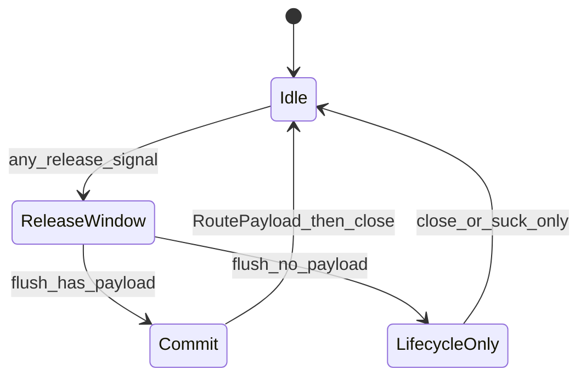
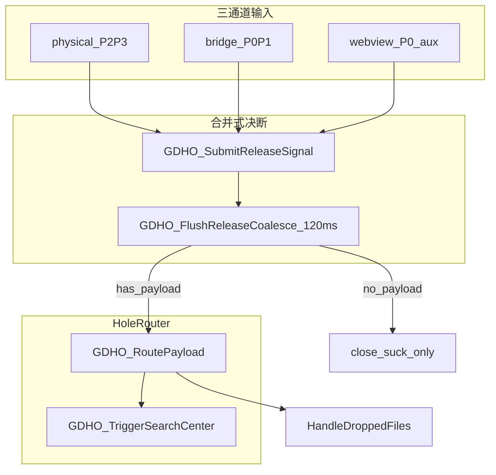

# 黑洞模式：松手决断 + 搜索闭环 + HoleRouter（修订版）

## 现状与缺口（已核对）

| 问题 | 根因（代码位置） |
|------|------------------|
| 叠层卡死 | `OPENING` 未晋升 + close 在 ready 前 defer；WebView 僵死时 `GDHO_ForceReset` 未销毁控件 |
| 文本吸入不搜索 | `GDHO_CompleteSessionTextCapture` / `canCommit` / `GDHO_ExecuteDropCommand` 文本分支悬空 |
| 通道各自为战 | Poll / Bridge / WebView 终点不一致，且存在 10~30ms 并发竞态 |

**搜索投递链路**：`GDHO_TriggerSearchCenter` → `TrayMenu_HardenHoleUiTransition` → `FloatingToolbar_RequestSearchByKeyword` → `SearchCenter_RunQueryWithKeyword` → SCWV + SearchCenterCore HTTP。

**用户确认**：Go 不新增 `drag_leave`；HTML 改 `hole_starry.html` + `hole.html`。

---

## 批判性修订：四个隐形致命点

以下四项为原方案必须修正的设计缺陷；实现时以本节为准，覆盖下文各步骤中的冲突描述。

### 隐患 1：多通道雪崩 — 简单防抖会吞掉带 Payload 的信号

**问题**：`physical`（无文本）常比 `webview_drop` / `bridge_drop`（有文本）早 0~48ms 到达；若 `g_GDHO_ReleaseDebounceMs := 80` 对**所有来源一视同仁**地「先到先得」，物理通道会先执行 `GDHO_RequestClose` + `ResetSession`，后续带 Payload 的信号被丢弃 → 洞关了、Router 没吃到字。

**修订：优先级合并式决断（Coalescing Arbiter），禁止裸防抖**



核心规则：

| 优先级 | 来源 | 允许在合并窗内做的事 |
|--------|------|----------------------|
| P0 | `bridge_drop`（OLE 真 drop，含 files/text） | 写入 `g_GDHO_PendingCommit` |
| P0 | `webview_drop`（`hole_web_drop` 含 text/files） | 同上 |
| P1 | `bridge_drag_end` 且 `canCommit=true` | 写入 commit（附 `NativeDropBridge_CaptureTextSeed()`） |
| P2 | `physical` 且在 suck 区 | 触发 `GDHO_ForceSuckAction`（文本由 Complete 回调入 commit） |
| P3 | `physical` / `bridge_drag_end` 无 commit | **仅**生命周期：close / reset，**不得**在 P0/P1 待决期间抢先 close |

实现要点（[`GlobalDragHoleOverlay.ahk`](modules/GlobalDragHoleOverlay.ahk)）：

- `global g_GDHO_ReleaseCoalesceMs := 120`（合并窗，非阻断防抖）
- `global g_GDHO_PendingCommit := Map("kind", "", "data", "", "sources", [])` 
- **`GDHO_SubmitReleaseSignal(source, ctx)`** 只**登记**到 `g_GDHO_PendingCommit` 并按优先级升级 `kind/data`，**不立即** close
- 首次登记时 `SetTimer(GDHO_FlushReleaseCoalesce, -g_GDHO_ReleaseCoalesceMs)`；Flush 时：
  - 若 `PendingCommit.kind != ""` → `GDHO_RoutePayload` → 再 `GDHO_SessionTeardown("commit")`
  - 否则 → `GDHO_HandlePhysicalRelease`（原 suck/close 逻辑）
- **物理松手禁止在合并窗打开时**调用 `GDHO_RequestClose`（仅登记 P2/P3）
- Router 层 `g_GDHO_LastRouteSig` 400ms 去重（防 commit 后重复搜索），与合并窗职责分离

[`CursorHelper (1).ahk`](CursorHelper (1).ahk)：`drag_end` 只提交信号进合并器；`NativeDropBridge_ResetSessionAsync` 推迟到 Flush 之后（或由 Flush 统一调用）。

---

### 隐患 2：Click-Through (+0x20) 与 WebView HTML5 Drop 悖论

**问题**：`WS_EX_TRANSPARENT` 下系统 OLE 不投递给该 HWND；WebView `drop` 在多数轨迹上收不到事件。原方案把 HTML5 当主通道不成立。

**修订：通道定位 + 会话级临时取消穿透**

| 通道 | 角色 | 可靠性 |
|------|------|--------|
| AHK `GDHO_PollDrag` + `GDHO_ForceSuckAction` + `^c` | 文本主路径 | 高（不依赖 HWND 接 drop） |
| Go `native-drop-bridge` `drop` / `drag_end` | 系统 OLE 权威补充 | 高（进程外钩子） |
| WebView `hole_web_drop` | **辅助增强** | 仅会话交互态可靠 |

代码策略：

1. **会话武装时取消整窗穿透**：`NativeDropSessionActive || GDHO_ACTIVE` 时，对 `GDHO_GUI` 调用 `WinSetExStyle("-0x20")`（现有 [`GDHO_ApplyDropHitTestByProximity`](modules/GlobalDragHoleOverlay.ahk) 在 `prox>=0.88` 才取消，**升级为**：`DragSessionTick` / `GDHO_Update` 在 `sessionActive` 期间保持 `GDHO_INTERACTIVE`，而非仅内核小圆）
2. **HTML5 仍实现**，但在 AHK 侧标注 `source=webview_drop` 为 P0；若 `GDHO_CLICKTHROUGH` 仍为 true 时收到消息，打日志 `webview_drop_while_clickthrough` 并**降级**为仅登记（不期望常态发生）
3. **文档/注释**：不得假设「拖过洞面必触发 webview drop」；验收以 Poll+Bridge+canCommit 为准
4. [`hole_starry.html`](hole_starry.html) / [`hole.html`](hole.html)：`drop` 内 `postMessage` + 保留动画；失败不影响主路径

---

### 隐患 3：SelectionSense「剪贴板大劫持」

**问题**：划选已 `ProcessDeferred` 模拟 `^c` 得到文本后，再在 150ms 内 `TriggerSearchCenter` / `ForceSuck` 二次 `^c`，与用户立刻 Ctrl+V、敲键覆盖冲突。

**修订：一次采集、直通 Router、用户意图熔断**

1. **禁止二次 `^c`**：`SelectionSense_TryActivateHoleFromSelection(selectedText)` 只使用 `ProcessDeferred` **已写入**的 `g_SelSense_LastFullText`，调用 `GDHO_RoutePayload("text", selectedText)` 或 `GDHO_TriggerSearchCenter(selectedText)`，**不再**在 suck/selection 路径 Send `^c`
2. **取消「固定 150ms 开搜索」**：改为 `GDHO_RequestOpen(selection_copy)` 动效后，`SetTimer(GDHO_RoutePayload.Bind("text", t), -120)` 且 Route 内再走 TriggerSearchCenter（合并器外，划选无 release 风暴，单独定时即可）
3. **用户意图熔断**（[`SelectionSenseCore.ahk`](modules/SelectionSenseCore.ahk)）：
   - 调度搜索前检查：`g_SelSense_UserCopyInProgress`、`CapsLockCopyInProgress`、`(A_TickCount - g_SelSense_UserCopyEndTick < 950)` → 取消并打日志 `hole_abort=user_copy_guard`
   - 注册一次性 `InputHook` 或检测 `GetKeyState("v","P")` with Ctrl：150~300ms 内用户 Ctrl+V → `SelectionSense_CancelPendingHoleSearch()`
   - `OnLButtonDown` 新一轮按下 → 取消 pending 定时器
4. **不默认「划选即搜索」强绑定**（可选配置项预留）：默认保持 hole 模式「划选 → 洞预览 + 搜索」；若后续要弱化，在 ini 增加 `SelectionSenseHoleAutoSearch=1`

`GDHO_TriggerSource := "selection_copy"` 保留；`NativeDropBridge_ResetSession` 对 `selection_copy` 的 skip 保留，避免 drag_end 清掉划选会话。

---

### 隐患 4：OPENING 卡死 — ForceReset 不销毁 WebView

**问题**：`GDHO_ForceReset` 清标志、Park 窗口，但 WebView2 Controller/导航僵死时，下一周期仍可能是「隐形全屏墙」。

**修订：硬回收（Hard Recycle）**

新增 [`GlobalDragHoleOverlay.ahk`](modules/GlobalDragHoleOverlay.ahk)：

```ahk
GDHO_HardRecycleHost(reason := "") {
    ; 1) g_GDHO_CurrentToken++ 作废一切 in-flight JS/Timer
    ; 2) 停止 Poll 内会话（不 Disarm 整个 hole 模式）
    ; 3) 若 GDHO_WV2：Controller.Close() / 释放 COM（按现有 WebView2 封装）
    ; 4) 若 GDHO_GUI：Destroy()，置 GDHO_GUI:=0, GDHO_WV2:=0, GDHO_READY:=0
    ; 5) GDHO_ForceReset(reason)
    ; 6) 若 g_HoleRuntimeEnabled：GDHO_PrewarmOffscreen 或下次 OPEN 时完整 GDHO_Init
}
```

触发条件（替换原「仅 ForceReset」）：

- `GDHO_HandleStuckOverlayGuard`：`IsOpeningOrBusy()` > 3s → `GDHO_HardRecycleHost("stuck_opening")`
- 现有 `GDHO_AntiHangTick` 超时 → `HardRecycle` 而非仅 `FORCE_RESET` intent
- `GDHO_FlushReleaseCoalesce` 若 `!GDHO_READY && elapsed>5s` → recycle

**不做**全局 `ProcessClose(msedgewebview2)`（影响 SCWV/工具栏）；仅销毁 **GDHO 专属** Gui 与 Controller。

---

## 架构总览（修订后）



---

## 第一步：合并式松手决断中心

### 1.1 核心 API（[`GlobalDragHoleOverlay.ahk`](modules/GlobalDragHoleOverlay.ahk)）

- `GDHO_SubmitReleaseSignal(source, ctx)` — **只登记 + 启动/刷新合并定时器**
- `GDHO_FlushReleaseCoalesce(*)` — 唯一执行 close/commit 的出口
- `GDHO_HandlePhysicalRelease(mx, my)` — 仅在 Flush 无 payload 时调用
- `GDHO_HandleStuckOverlayGuard(lDown)` — 卡死时 `GDHO_HardRecycleHost`
- `GDHO_SessionTeardown(reason)` — 统一 ResetSession + RequestClose + 恢复 click-through

### 1.2 `GDHO_PollDrag`

- 循环开头：`lDown` + `HandleStuckOverlayGuard`
- `!lDown` → `SubmitReleaseSignal("physical", Map("mx", mx, "my", my, "inSuckZone", ...))`，**不直接** Close

### 1.3 Go Bridge（[`CursorHelper (1).ahk`](CursorHelper (1).ahk)）

- `drag_end` → 带 `canCommit`、坐标入 ctx → `SubmitReleaseSignal("bridge_drag_end", ctx)`
- `drop`（含 text）→ `SubmitReleaseSignal("bridge_drop", evt)`；**不再** ignore text
- `ResetSessionAsync` 默认由 Flush/teardown 触发，避免与合并窗竞态

### 1.4 WebView2（辅助通道）

- [`hole_starry.html`](hole_starry.html)、[`hole.html`](hole.html)：`hole_web_drop` postMessage
- [`GDHO_OnWebMessage`](modules/GlobalDragHoleOverlay.ahk)：`SubmitReleaseSignal("webview_drop", payload)`
- 依赖会话期 `-0x20`（见隐患 2）

---

## 第二步：吸入 → 搜索闭环

### 2.1 `GDHO_TriggerSearchCenter(keyword)`

- `TrayMenu_HardenHoleUiTransition("hole_search_commit", 1200)`（[`TrayMenuManager.ahk`](modules/TrayMenuManager.ahk) 将 `hole_search_commit` 纳入 `isSearchOpen`）
- `GDHO_SetClickThrough(true)` 后再 `FloatingToolbar_RequestSearchByKeyword(kw)`
- **不**在此函数内 Send `^c`

### 2.2 Router 接入点

| 调用点 | 改造 |
|--------|------|
| `GDHO_CompleteSessionTextCapture` | 写入 PendingCommit 或 Flush 后直接 `RoutePayload("text", ...)` |
| `GDHO_FlushReleaseCoalesce` | 有 payload → Route |
| `bridge_drag_end` canCommit | 登记 P1，Flush 时 Route |
| `GDHO_HandleDropPayload` text | Route |
| `NativeDropBridge_ApplyDropAction` text | 改为登记/Route，删除 overlay_only 早退 |

---

## 第三步：SelectionSense（修订）

[`SelectionSense_TryActivateHoleFromSelection`](modules/SelectionSenseCore.ahk)：

1. 熔断：user_copy_guard / Ctrl+V / 新 LButtonDown → return
2. `GDHO_RequestOpen(selection_copy)` + 轻量 `update` 动效
3. `SetTimer(() => GDHO_RoutePayload("text", selectedText), -120)` — **使用已采集文本，无二次 ^c**
4. `SelectionSense_HideHoleAfterSelection` 保留，defer 逻辑不变

---

## 第四步：HoleRouter

```ahk
GDHO_RoutePayload(payloadType, data) {
    ; sig 去重 400ms
    switch payloadType {
        case "text": GDHO_TriggerSearchCenter(data)
        case "file": FloatingToolbar_HandleDroppedFiles(data)
        case "image": ; 预留 OCR
    }
}
```

---

## 第五步：Tray handoff

- `hole_search_commit` handoff
- `selection_copy` 时 `ResetSession` skip 保留
- Router 文本 sig 去重（与合并窗分离）

---

## 文件改动清单

| 文件 | 改动 |
|------|------|
| [`modules/GlobalDragHoleOverlay.ahk`](modules/GlobalDragHoleOverlay.ahk) | 合并决断、HardRecycle、会话穿透、Router、TriggerSearchCenter |
| [`CursorHelper (1).ahk`](CursorHelper (1).ahk) | Bridge → 合并器；canCommit；Reset 时序 |
| [`modules/SelectionSenseCore.ahk`](modules/SelectionSenseCore.ahk) | 无二次^c、用户熔断 |
| [`modules/TrayMenuManager.ahk`](modules/TrayMenuManager.ahk) | hole_search_commit |
| [`hole_starry.html`](hole_starry.html)、[`hole.html`](hole.html) | hole_web_drop（辅助） |

---

## 验证清单（含回归四隐患）

1. **雪崩**：拖文本松手后 120ms 内日志应出现多 source 登记，最终 **一次** `[HoleRouter]`，洞关闭且搜索有词（不应只有 `drag_release` 无 Router）
2. **穿透**：拖入洞心时 `GDHO_CLICKTHROUGH=0`；非交互区不依赖 webview drop 也能搜索（Poll/Bridge）
3. **剪贴板**：划选后 200ms 内 Ctrl+V 粘贴原内容，不应被黑洞洗掉；日志 `hole_abort=user_copy_guard` 或 cancel pending
4. **僵死**：模拟 OPENING>3s（或断网加载 hole 页）→ `HardRecycle` 后再次拖放仍可出洞
5. 文件拖入、托盘搜索、hole 模式切换仍正常

---

## 风险与约束

- 合并窗 120ms 会略延迟 close 动画，可配置 `ReleaseCoalesceMs`
- WebView drop 为增强项，主路径不依赖
- HardRecycle 仅针对 GDHO 宿主，不杀全局 Edge 进程
- UAC 边界 ^c 仍可能失败；空文本仅日志

---

## 执行状态（2026-05-19）

**已完成（Agent 模式落地）**

- `modules/GlobalDragHoleOverlay.ahk`：合并决断、`webRichPayload` 优先 Flush、`GDHO_RoutePayload` / `GDHO_TriggerSearchCenter`、`hole_web_drop`（含 `richPayload`）、HardRecycle、Poll 与 Bridge 协同等。
- `CursorHelper (1).ahk`：`drag_end` / `drop` → `SubmitReleaseSignal`；`hole_search_commit` 仅用于 `hideOverlay` 异步分支，**不**再列入 `specialUiReason`（避免 `NativeDropSessionActive` 时整段 reset 被误跳过）。
- `modules/SelectionSenseCore.ahk`：划选 serial + 延迟 `RunPendingHoleRoute` → `GDHO_RoutePayload`。
- `modules/TrayMenuManager.ahk`：`hole_search_commit` 纳入 `isSearchOpen`。
- `hole_starry.html`：`drop` 时 `postMessage` JSON `hole_web_drop`（text / file paths）。
- `hole.html`：`drop` 改为仅 `postHostMessage(JSON.stringify({ type:'hole_web_drop', richPayload: payload }))`，与合并窗一致且保留 `readDropPayload` 富结构（经 `webRichPayload` → `GDHO_HandleDropPayload`）。**仍支持**旧版 `hole_drop` 消息（其它入口若未改）。

**待你本机验证**：验证清单第五节（拖选→洞→搜索、Bridge 文本、文件拖入、OPENING 僵死 HardRecycle、Ctrl+V 熔断）。
