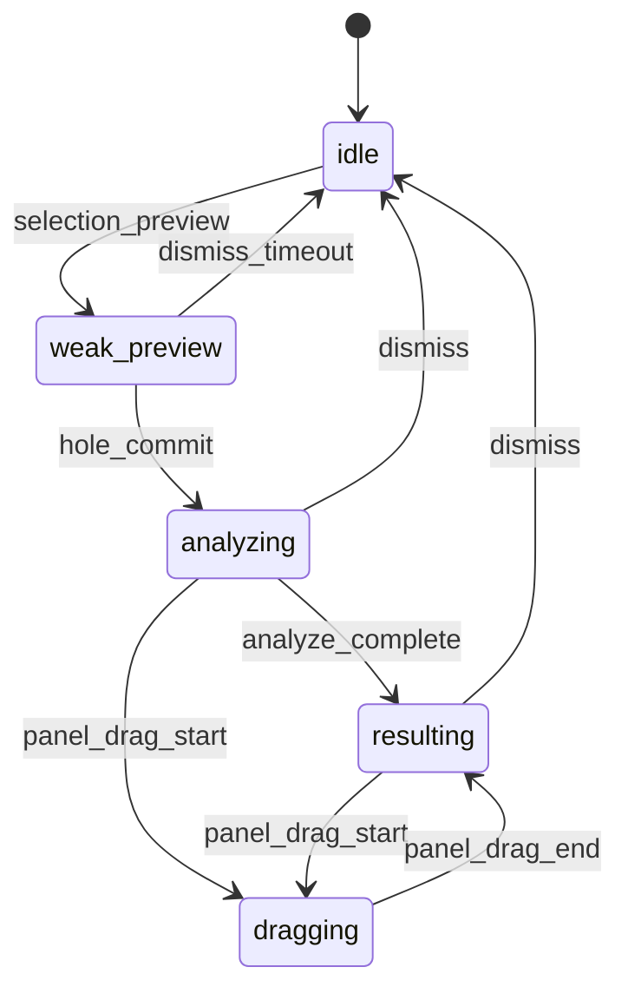

# InteractionManager 与五项策略评估

## 五项策略能否彻底解决？

| # | 策略 | 能否解决 | 前提 |
|---|------|----------|------|
| 1 | AHK 禁止 WindowStyle/坐标，只做 WS 信使 | **是（必要条件）** | 删除/禁用所有 `GDHO_Move*`、`HidePanel`、`ParkPanel`、`SetWindowPos` |
| 2 | 五状态 FSM（含 WeakPreview） | **是** | 划选→`weak_preview`，点击/提交→`analyzing`，与现网动线一致 |
| 3 | Go `WindowController` + `TransitionTo` | **是（Go/Wails 侧）** | `controller != nil` 且运行在 Wails 主线程 |
| 4 | 切断 `panel_moved` / AHK Move | **是** | 前端只渲染 `interaction_state`；拖动发 `pointer_move` |
| 5 | Wails 自算布局，AHK 只报锚点 | **是** | 锚点为「建议」；最终位置由 Wails/CSS 决定 |

**总评：五项全部落实 + P2 窗口宿主迁入 Wails 后，可清算当前抖动/消失类 Bug。**  
任一环节仍让 AHK 操作 HWND，问题会以其他形式复发。

## 五状态 FSM



| 状态 | 窗口策略（controller） |
|------|------------------------|
| `idle` | HideHole + HidePanel |
| `weak_preview` | ShowHole, HidePanel, MoveTo(anchor) |
| `analyzing` | ShowHole（吸入动画） |
| `resulting` | HideHole, ShowPanel |
| `dragging` | HideHole, ShowPanel, MoveTo 由 pointer_move 驱动 |

## P0 AHK 信使 JSON

- WebView / 前端：`ws://127.0.0.1:18790/hole`
- AHK（WinHttp）：`POST http://127.0.0.1:18790/hole/event`（与 WS 入站同一 `HandleWSInbound`）
- 开关：`modules/GDHO_P0Messenger.ahk` 中 `GDHO_P0_READONLY := true`

```json
{"type":"selection_preview","text":"...","anchorX":1200,"anchorY":640}
{"type":"hole_commit"}
{"type":"pointer_move","screenX":1210,"screenY":650}
{"type":"panel_drag_start"}
{"type":"panel_drag_end"}
{"type":"dismiss","reason":"esc"}
```

AHK **禁止**：`Gui.Move`、`Hide`、`DllCall("SetWindowPos")`、`WinSetTransparent` 作用于黑洞/面板宿主。

## 实现位置

- [`tools/native-drop-bridge/interaction_manager.go`](../tools/native-drop-bridge/interaction_manager.go) — 五状态 + `WindowController`
- [`prototype/wails-toolbar-app/interaction_manager.go`](../prototype/wails-toolbar-app/interaction_manager.go) — Wails 适配器示例

## 面板宿主生命周期（AHK，现网）

| 阶段 | 行为 |
|------|------|
| 平时 / 弱预览 | `GDHO_ShelvePanelHost`：`Gui.Hide` + 点击穿透 + `#010101` 抠色 |
| 黑洞提交 / 展开完成 | `GDHO_ActivatePanelHost` + `ShowPanelForced`：实心可交互，可拖动 |
| Esc / 关闭 | `GDHO_ShelvePanelHost("dismiss_*")` + WS `dismiss` |

## 迁移阶段

| 阶段 | 内容 |
|------|------|
| P0 | AHK 发 WS；Go IM 广播；AHK 侧 feature flag 关闭 GDHO 窗口操作 |
| P1 | 删除 `postHost(panel_moved)`；HTML 订阅 `interaction_state` |
| P2 | Wails 注入 `WindowController`；退役 AHK WebView 双窗 |
| P3 | 删除 `GDHO_GetInteractionPhase` 等重复守卫 |

## P1 full_defer（现网）

- 弱预览：**不** `CreatePanelGui` / 不创建 Panel WebView2；仅星空 + `GDHO_WS_SendSelectionPreview` → Go `weak_preview`。
- `analyzing`（commit）：`GDHO_EnsurePanelHostForPhase("analyzing")` 首次创建面板宿主并 Navigate。
- 前端：`hole_starry.html` / `hole_panel.html` 订阅 `interaction_state`（带 `version` 去重）；面板 JS `ensurePanelLoaded()` 懒加载。
- P2 迁入 Wails 后，`interaction_state` 仍为真源；`EventsEmit("hole_window")` 仅辅助布局。
