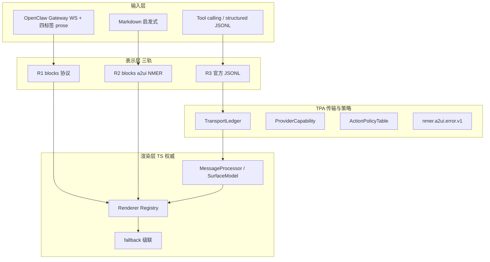

# A2UI 体系架构 v2（逻辑修订版）

本文档修订早期方案中的过度表述，定义牛马 nmer **A2UI / CommandPalette 卡片 UI** 的诚实架构边界。

**相关文档：**

- 操作与 Spike：[`a2ui-v0.9-spike-guide.md`](./a2ui-v0.9-spike-guide.md)
- Wails 批次：[`wails-migration-boundary.md`](./wails-migration-boundary.md)
- blocks schema：[`md/docs/palette-blocks-schema.md`](../md/docs/palette-blocks-schema.md)
- 错误码：[`nmer-a2ui-error-v1.md`](./nmer-a2ui-error-v1.md)
- FTB 模块图：[`ftb-module-map.md`](./ftb-module-map.md)

---

## 1. 北极星（修订）

**不是：** 单一数据契约、Go spec 级权威、单 WebView 宿主、五层独立回退开关。

**而是：**

```text
· 三表示长期并存（R1 / R2 / R3）
· 单一渲染调度（Renderer Registry）
· 传输与策略权威 TPA（Transport & Policy Authority，契约与实现分离）
· 二维显式决策 + 自动级联 fallback
· 三层校验（Format / Schema / Semantic）
```

### 1.1 三表示（Three Representations）

| 轨 | 名称 | 数据结构 | 语义来源 | 生产默认 |
|----|------|----------|----------|----------|
| **R1** | 协议块 | `blocks[]` plan/status/question/reply/error | 四标签 `::PLAN_*::` 等 + Pipeline | **是** |
| **R2** | NMER 组件块 | `blocks[] type=a2ui`（ComparisonTable/Steps/Alert/ActionChips） | finalize 后 Markdown 启发式 + ComponentMatcher | **是** |
| **R3** | 官方 A2UI | `nmer.a2ui.transport.v1` 信封 + A2UI v0.9 `message` | JSONL 流 + MessageProcessor | **否（实验）** |

**非目标：** 将 R1/R2/R3 合并为一种 schema。三者语义不等价，**长期并存**；只允许通过 Registry 与 fallback 序协调，不承诺双向自动映射。

### 1.2 渲染调度（单一入口）

所有表示最终经同一调度层进入 DOM：

```text
PaletteHostAdapter（入站 DTO）
  → BlockStore / OfficialA2UIBridge（按轨分流）
  → PaletteCardRenderer + Renderer Registry
  → Lit 槽位 或 legacy DOM
  → 级联 fallback（见 §5）
```

Lit **仅**作为 card slot renderer，不是整页 SPA。

---

## 2. 分层职责



### 2.1 TPA（Transport & Policy Authority）

**定义：** NMER 自研的传输与策略契约集合，**不是 A2UI spec 的一部分**。

| 契约 | 版本 | 当前实现 |
|------|------|----------|
| 传输信封 | `nmer.a2ui.transport.v1` | Go `poc/a2ui.go` + `wshub.go` |
| Action 上行 | `nmer.a2ui.action.v1` | Go `poc/a2ui_action.go` |
| Action 回执 | `nmer.a2ui.action-result.v1` | Go `poc/wshub.go` |
| 错误 | `nmer.a2ui.error.v1` | 见专文（待全面接入） |

**实现可迁移：** TPA 可运行在 Wails 内 Go 进程、独立 sidecar Go binary、或其他语言——**稳定的是契约，不是 Wails**。

**铁律：** TPA 决策，TS 兜底展示。

### 2.2 TransportLedger（非 SurfaceStore）

**禁止：** 在 Go 侧复制组件树 / data model（与 `@a2ui/web_core` MessageProcessor 双写）。

**允许：** Go 侧仅维护传输账本：

| 字段 | 用途 |
|------|------|
| `cardId` / `surfaceId` / `correlationId` | 隔离与审计 |
| `seq` | **唯一排序键**（重放、去重、对账） |
| `final` | 表面结束标记 |
| envelope 原文哈希或截断引用 | 审计，非渲染 |

**渲染态权威：** TS `MessageProcessor` + `SurfaceModel`（`apps/nmer-wails/frontend/src/a2ui-spike/runtime.ts` 及 CP 内 `nmer-a2ui-v09.js`）。

重连流程：Ledger 按 `seq` 重放 envelope → TS 重建 Surface；不一致 → 错误码 + fallback。

### 2.3 三层校验

| 层 | 职责 | 负责方 | 示例 |
|----|------|--------|------|
| **L-Format** | 合法 JSON/JSONL 行 | Provider tool calling / 解析器 | 模型输出可解析 |
| **L-Schema** | 类型、白名单、引用存在 | TPA + TS | 组件 ≤200、仅六组件 |
| **L-Semantic** | 业务合理、跨 surface、card 归属 | TPA 策略 + TS 二次校验 | 深度上限、cardId 匹配 |

**非目标：** 将 tool calling 等同于端到端合规。Format 合规后仍需 L-Schema 与 L-Semantic。

### 2.4 Provider 与能力

**非目标：** 「一个 interface 换 Provider 不动前端」。

实际需要：

```text
ProviderAdapter（每厂商/每协议一个）
  → 声明 ProviderCapability
  → TPA 做 capability negotiation
  → 前端 Registry 按 capability 选 R1/R2/R3 分支
```

| Provider 路径 | 协议 | 产出表示 | 状态 |
|---------------|------|----------|------|
| OpenClaw Gateway | WS `chat.send` + prose | R1（+ 可选 R2 finalize） | **生产** |
| Fake / HTTP Adapter | `nmer.a2ui.action.v1` → JSONL | R3 | POC |
| OpenAI-compatible | `/chat/completions` + prompt/tool | R3 | 实验 |

OpenClaw **不**直连为 OpenAI HTTP；见 `a2ui-v0.9-spike-guide.md` §P3。

---

## 3. 宿主与 WebView 域

**非目标：** 「Wails 单宿主 = 1 个 WebView」。

### 3.1 功能域收敛（诚实目标）

| 域 | 当前宿主 | 目标 | 说明 |
|----|----------|------|------|
| **A. 命令面板卡片** | `CommandPaletteCore.ahk` WebView2 | Wails 单窗（B3） | 卸 `g_CmdPal_WV2` |
| **B. Niuma Chat / OpenClaw** | `FloatingToolbarStrip.html` WebView2 | FTB 瘦身后保留（FTB-5 前不动） | 见 `ftb-module-map.md` |
| **C. 系统面板** | Config / Search / Clipboard / VK 等 | 独立 WebView 可接受 | 按域计内存 |

B3 只减少 **域 A** 的一个 WebView（约 500MB–1GB 量级），不是全项目单 WebView。

### 3.2 并行运行纪律

- 日常：**不要**常开 `wails dev` + 全套牛马
- B2 后：`nmer-wails.exe` 作 TPA sidecar，由 AHK 守护
- CP 隐藏：`WebView2_NotifyHidden`（域 A 内存）

---

## 4. 会话与隔离

### 4.1 隔离三元组

| 键 | 作用 |
|----|------|
| `cardId` | CP 卡片生命周期 |
| `correlationId` | 一次用户任务链 |
| `surfaceId` | 官方 A2UI 表面 |

**规则：**

- 禁止跨 `cardId` 复用 OpenClaw `sessionKey`（除非显式 `sessionRef` 继承）
- 同一 `surfaceId` 下 `seq` 单调递增；`final` 后 Ledger 清 seq 状态
- 多窗口 CP：共享 `actionState` 行为须文档化；新卡默认新 `correlationId`

### 4.2 协议版本

| 层 | 锁定版本 | 不匹配行为 |
|----|----------|------------|
| NMER transport | `nmer.a2ui.transport.v1` | 拒收，错误码 `TPA_TRANSPORT_VERSION_UNSUPPORTED` |
| A2UI message | `v0.9` + basic catalog URL | 拒收，错误码 `A2UI_PROTOCOL_VERSION_UNSUPPORTED` |
| blocks | `blockVersion: 1` | Pipeline 拒收或降级 |

**非目标：** 运行时与 Provider 协商 A2UI v1.0。升级需发版 + fixture 全绿。

### 4.3 时间与重放

- **排序权威：`seq`，不是 `ts`**
- `ts` 仅用于日志与 Debug
- WS 重连：重放最近 N 条 envelope（当前 Go：`a2uiReplayBufferSize=128`，CP 客户端限制 20 卡）
- 时钟偏差不影响重放逻辑

---

## 5. 回退（二维决策 + 级联）

**非目标：** 五层独立开关。

### 5.1 显式决策（2 维）

| 维度 | 开关 | 默认 |
|------|------|------|
| **D1 进程/通道** | `wailsBridge.enabled`、`officialA2ui.enabled` | bridge 开（B2 后）/ official **关** |
| **D2 生产 Agent 传输** | `paletteAgent.transport`：`ftb` \| `adapter` | `ftb` |

配置文件建议：`local/nmer-flags.json`（不进 Git，模板见 `env.example` 说明）。

### 5.2 自动级联（检查点，非开关）

```text
R3 官方 Surface 渲染失败
  → 保留 R1 reply markdown
  → 保留 R2 NMER a2ui（若已有）
  → 显示 fallback 文案（不白屏）

R1 finalize 失败
  → rawAnswer markdown 占位

D1 official 关闭
  → 不挂载 .card-official-a2ui WS
  → R1/R2 不受影响
```

### 5.3 宿主级回退

| 条件 | 动作 |
|------|------|
| B3 失败 | `CommandPaletteUseWebView=true`，恢复 CP 专用 WebView2 |
| TPA 进程不可用 | 跳过 R3；生产仍走 R1/R2 + FTB OpenClaw |
| `rollback.forceNmerOnly=true` | 禁用一切 R3 入口 |

### 5.4 演练清单

| ID | 场景 | 预期 |
|----|------|------|
| R1 | 杀 `nmer-wails.exe` | R1/R2 正常；R3 降级文案 |
| R2 | `forceNmerOnly=true` | 无官方 WS；fixtures 128/128 |
| R3 | malformed JSONL | fallback 文本；旧 reply 可见 |
| R4 | OpenClaw 断连 | 明确错误；卡片可 recover |
| R5 | B3 回滚 | `CommandPaletteUseWebView` 恢复 |

---

## 6. Action 安全

**权威序（高 → 低）：**

1. **TPA ActionPolicyTable**（硬编码策略表，非模型）
2. Schema / 契约字段（`kind: safe`，`actionName` 白名单）
3. 模型或 Provider 附带标签（**不可信**）

当前实现：仅 `safe.follow-up`，`kind: safe`，深度 ≤2，10s 去重（`a2ui_action.go`）。

**非目标：** 由模型标注 `destructive` 并直接执行。

---

## 7. 数据生命周期与隐私

| 数据 | 存储 | 清空时机 |
|------|------|----------|
| TransportLedger | 进程内存 | 进程退出 |
| MessageProcessor 状态 | WebView 内存 | Surface delete / 卡销毁 |
| `blocks[]` 持久化 | 卡片轻量壳 | 按 BlockStore 裁剪策略 |
| 官方 A2UI 原文 | **默认不持久化** | — |
| OpenClaw 会话历史 | FTB `localStorage`/会话对象 | 用户清会话 |

敏感 query / 表格：持久化走 `BlockStore.pack` 裁剪；不上传至 TPA 日志全文。

---

## 8. 离线与断网

| 场景 | 行为（目标） |
|------|--------------|
| WS 断线 | 指数退避重连；Ledger 重放 |
| 进行中 OpenClaw 任务 | 标记 `stale`；允许 `palette_agent_recover` |
| 用户断网输入 | 队列本地草稿；恢复后手动重发（不自动 submit） |
| 已渲染卡片 | 纯本地 blocks 可继续展示 |

---

## 9. 主题与样式

NMER 四组件（`.card-a2ui`）与官方（`.card-official-a2ui`）须通过 **Design Token 桥**（CSS 变量）对齐，避免两套 CSS 在同一卡片冲突。

最低要求：`--palette-a2ui-primary`、`--palette-a2ui-surface-bg` 等由 CP 根节点注入。

---

## 10. 上游依赖与应急

| 依赖 | 版本策略 | 上游停更时 |
|------|----------|------------|
| `@a2ui/web_core` / `@a2ui/lit` | pin `0.10.0` | 独立 bundle `nmer-a2ui-v09.js` 可离线运行 |
| Wails v2 | pin `v2.12.0` | TPA 可拆为独立 Go binary + 任意 WebView |
| WebView2 Runtime | 系统自带 | 回归 CP/FTB 启动 smoke |
| Go | 1.22+ | 仅影响构建 |

**最小运行集（无 Wails）：** CP WebView2 + FTB + R1/R2 全功能；R3 不可用。

---

## 11. 改造批次（逻辑序）

与 `wails-migration-boundary.md` 对齐，补充 A2UI 语义：

| 批次 | 内容 | 表示 |
|------|------|------|
| B0–B1.5 | POC、护栏、并列入口 | R3 实验 |
| B2 | AHK 守护 TPA sidecar | D1 可用性 |
| FTB-0–1 | 模块测绘 + 抽 `palette-agent-bridge` | 解耦域 B |
| Phase 2 | TransportLedger + 错误码 + L-Semantic | R3 加固 |
| Phase 2b | OpenClaw 四标签 L-Semantic（OC 基线） | R1 加固 |
| Phase 2c | 官方 Provider tool calling | R3 L-Format |
| B3 | CP 迁入 Wails | 域 A 收敛 |
| P4 | 灰度 `officialA2ui.enabled` | 需 Phase 2 达标 |

---

## 12. 非目标清单（明确不做）

1. 合并 R1/R2/R3 为单一 schema
2. Go 侧复刻 SurfaceModel 组件树
3. OpenClaw 直连 `18789` 当 OpenAI HTTP
4. 模型输出作为 Action 安全权威
5. 一次性删除 NMER 四组件或 128 fixtures
6. 一次性迁移 FTB 25k 行
7. 宣称「单 WebView 宿主」在未完成域 A+B 收敛前
8. Wails v3 多窗合一（B5 需求未明前）
9. Provider 逻辑写入 Lit 组件
10. 无错误码的静默降级（须 `nmer.a2ui.error.v1`）

---

## 13. 暂停线

出现任意一项则停止扩大 R3 / B3 范围：

- `node html/run-palette-fixtures.mjs` 非 `128/128`
- Action 可绕过 `kind: safe`
- fallback 无法回到可读 Markdown
- Surface 切换后组件未释放、内存单调涨
- Provider 逻辑进入 Lit
- 单 patch 同时改 streaming + Lit + AHK 协议

---

## 14. 人力泳道（逻辑分工）

| 泳道 | 职责 |
|------|------|
| **A. TPA / 宿主** | Go Ledger、ActionPolicy、B2、Adapter |
| **B. 渲染 / TS** | Registry、CP 抽模块、fixtures |
| **C. 集成 / FTB** | FTB 拆解、OpenClaw 基线、Orchestrator |
| **D. 质量** | 错误码、回退演练、内存基准、灰度指标 |

同一 patch 不跨三泳道（沿用 Palette Patch 宪章）。

---

## 15. 文档变更记录

| 版本 | 说明 |
|------|------|
| v2.0 | 修订单一契约/Go 权威/单宿主/五层回退等过度表述；确立三表示 + TPA + 二维回退 |
