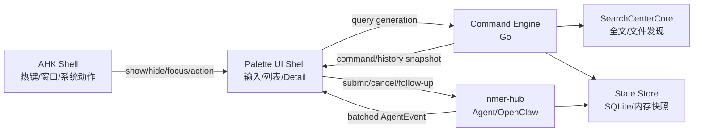

# CommandPalette 高性能现代化改造方案

## 1. 目标

在不丢失现有能力的前提下，把 CommandPalette 改造成接近 Raycast / macOS Spotlight 的使用体验：

- 快速唤起，输入不被后台能力阻塞。
- 默认界面简洁，复杂能力按需展开。
- 命令、文件、全文、剪贴板、AI、Agent 仍从同一入口访问。
- 保留 R1 / R2 / R3、OpenClaw、任务卡、ActionChips、语音与系统动作。
- AHK 继续负责热键和 Windows 自动化；Go 负责服务、状态和持久化；前端只负责可见界面。
- Wails 是可选宿主，不作为第一阶段性能优化的前置条件。

## 2. 当前问题

当前 `CommandPalette.html` 同时承担：

- 输入和意图路由；
- 命令、文件及 Provider 列表；
- Agent 卡片状态和完整历史；
- 流式协议解析、R1/R2/R3 渲染；
- AHK hostObject 同步调用；
- FTB 状态同步和恢复；
- DOM 高度测量及宿主窗口调整。

因此一个按键可能触发：

```text
input
  -> runQuery
  -> updateResults
  -> renderActionHistoryList
  -> hostObject 同步读取
  -> DOM 重建
  -> MutationObserver
  -> ResizeObserver
  -> syncWindowSize
  -> AHK Move/Bounds
```

发送和等待路径还会叠加 FTB readiness、整卡持久化、整批卡同步、逐 chunk 协议解析和 DOM 刷新。

## 3. 北极星架构



职责边界：

| 层 | 保留职责 | 移出职责 |
|---|---|---|
| AHK | 热键、窗口定位、系统动作、进程守护 | 查询排序、卡片持久化、流式状态编排 |
| Palette UI | 输入、可见列表、单个 Detail、局部渲染 | Provider 配置读取、整批历史同步、网络重试 |
| Command Engine | 命令注册、fuzzy rank、历史权重、查询合并 | DOM 和窗口尺寸 |
| nmer-hub | Agent、OpenClaw、会话、流式事件 | FTB/CP 的界面状态 |
| SearchCenterCore | Everything 发现、Bluge 全文索引 | CommandPalette 渲染 |

## 4. UI 信息架构

### 4.1 默认形态

采用三种离散布局，不再让每次 DOM 变化决定窗口高度：

| 模式 | 建议尺寸 | 内容 |
|---|---:|---|
| Compact | 720 x 72 | 输入框、模式图标、快捷提示 |
| List | 720 x 460 | 输入框、增量结果列表、底部动作栏 |
| Detail | 960 x 620 | 左侧列表、右侧详情或任务内容 |

窗口只在 `Compact -> List -> Detail` 切换时通知 AHK/Wails 调整一次。

### 4.2 视觉方向

- 使用 macOS 式材料层次，但不复制具体产品：半透明暖灰背景、细边框、柔和阴影。
- 高亮使用现有橙色品牌色，不采用通用紫色 AI 主题。
- 输入框始终是视觉中心，默认不展示复杂调试和 Provider 配置。
- 每行只显示图标、标题、补充说明、快捷键。
- 底栏展示 `Enter 打开`、`⌘/Ctrl+K 动作`、`Tab 详情` 等上下文操作。
- 动画只用于窗口出现、模式切换和 Detail 推入，时长 120–180ms。
- 支持减少动态效果设置。

### 4.3 功能呈现

```text
默认列表
  命令 / 最近使用 / 文件

输入 @
  Provider / AI 模式

输入 >
  系统命令模式

输入 /
  全文与文件搜索

输入 ?
  帮助与快捷键

选择任务
  右侧 Detail 展示 Agent 卡片
```

现有“本地 / 动作 / AI”意图继续兼容，但 UI 改为前缀、图标和可搜索 Action，而不是长期占用多个复杂面板。

## 5. 性能预算

| 指标 | 目标 | 硬门禁 |
|---|---:|---:|
| 热唤起到可输入 | <= 50ms | <= 100ms |
| 键入到本地结果 | <= 16ms P50 | <= 40ms P95 |
| Enter 到视觉确认 | <= 30ms | <= 60ms |
| 单个主线程任务 | <= 8ms | <= 16ms |
| Agent UI 刷新频率 | 10–20 FPS | 不逐 token 刷新 |
| 初始 DOM 行数 | <= 30 | <= 60 |
| 关闭后内存恢复 | 基线 +10% 内 | 基线 +20% 内 |

## 6. 实施阶段

### CP0 基线与可观测性

不改行为，先建立时间线：

- 前端使用 `performance.mark/measure` 记录 init、first-input、query、render、resize、submit、first-chunk。
- AHK 日志增加 `show_requested / web_ready / visible / submit_received / dispatch_ready`。
- nmer-hub 增加 `request_received / gateway_connected / first_event`。
- 新增 `Run-CommandPalettePerfGate.ps1`，输出 P50/P95 和最长主线程任务。

验收：能够区分 WebView 初始化、DOM、AHK 同步调用、FTB/hub 等待各自耗时。

### CP1 输入热路径瘦身

目标：先解决打字卡顿，不改宿主。

- 输入事件只更新输入状态和内存 fuzzy 结果。
- 禁止输入期间调用 `pullAgentCardsFromHostSync()`。
- Agent 历史仅在进入 Action 模式或打开 Detail 时异步读取。
- 命令注册表在页面 ready 后一次注入，前端建立只读快照。
- 文件/全文结果按 generation 异步补充；旧 generation 丢弃。
- `updateResults` 改为 keyed patch，不再重建整个结果容器。
- 首屏 DOM 限制为 30 行；性能数据证明必要后再引入虚拟滚动。

验收：断开 SearchCenterCore、nmer-hub 和 FTB 后，本地输入仍然流畅。

### CP2 布局与流式更新治理

- 移除结果容器上的全局 `MutationObserver -> syncWindowSize` 回路。
- `ResizeObserver` 只观察根容器，且每帧最多处理一次。
- 使用 Compact/List/Detail 离散尺寸。
- Agent chunk 进入内存缓冲，每 50–100ms 合并解析和渲染。
- 只有 block 结构变化时重渲染卡片；纯文本追加只更新当前 reply 节点。
- 非当前卡片仅更新标题、状态和时间，不渲染完整 blocks。
- 完成后再执行一次 finalize 和持久化。

验收：长回复期间输入、滚动、窗口拖动不明显掉帧。

### CP3 状态与持久化移出 AHK 热路径

- 建立 `PaletteStateStore`：
  - 内存维护卡片摘要；
  - SQLite 或 JSONL 增量持久化；
  - AHK 不再每次序列化全部卡片。
- 前端首次只拉最近 20 条摘要。
- Detail 打开时按 `cardId` 加载完整 blocks/history。
- 持久化使用 500–1000ms debounce，结束、隐藏或退出时 flush。
- Debug trace 不再每个事件重建完整 snapshot。

保留现有 `agent_cards.json` 只读迁移器和回滚导出。

### CP4 nmer-hub 成为 Agent 权威

- CP 不再要求 FTB WebView ready 才能发送。
- `submit/cancel/recover/follow-up` 直接调用 nmer-hub。
- nmer-hub 负责 OpenClaw session、重试、heartbeat、replay。
- FTB 和 CP 成为两个平级客户端，不再互相作为后端。
- 保留 `paletteAgent.transport=ftb` 回滚开关。

验收：

- FTB 隐藏或 Dispose 时 CP Agent 仍正常。
- Enter 后立即创建本地 pending 卡，网络连接在后台进行。
- 不再出现 `waiting FTB shell` 或 `deliver_ready_timeout`。

### CP5 前端模块化

把 [CommandPalette.html](../html/CommandPalette.html) 收缩为 shell：

```text
html/palette/app/
  bootstrap.ts
  palette-store.ts
  query-controller.ts
  intent-router.ts
  perf-marks.ts

html/palette/views/
  palette-shell.ts
  result-list.ts
  result-row.ts
  detail-pane.ts
  action-bar.ts

html/palette/agent/
  agent-summary.ts
  agent-detail.ts
  stream-batcher.ts

html/palette/search/
  command-index.ts
  result-merger.ts
```

复用现有：

- `PaletteHostAdapter`
- `PaletteBlockStore`
- `PaletteCardRenderer`
- `PaletteRendererRegistry`
- R1/R2/R3 fixtures

Debug、A2UI、Agent Detail 和 Provider UI 使用动态 `import()`。

### CP6 Wails 单窗灰度

完成 CP1–CP5 后再迁宿主：

- Wails 只承载 Palette UI，不把 FTB 合并进同一窗口。
- AHK 通过轻量 IPC 发 `show/hide/focus/action`。
- Go Command Engine 与 nmer-hub 可直接复用。
- 保留 `commandPaletteHost: ahk|wails` 灰度。
- AHK WebView 版本至少保留一个发布周期作为回滚。

Wails 迁移的价值：

- 窗口生命周期和 Go 服务连接更直接；
- 可退役 CP 专用 AHK WebView；
- 不负责解决 CP1–CP5 中的 DOM 和状态问题。

## 7. 功能保留矩阵

| 现有功能 | 新位置 |
|---|---|
| 命令/快捷键搜索 | Go Command Engine + UI 增量结果列表 |
| Everything 文件搜索 | SearchCenterCore 异步源 |
| 全文搜索 | SearchCenterCore 异步源 |
| AI Provider 列表 | nmer-hub 配置快照，按需加载 |
| Agent 任务卡 | 摘要列表 + 单 Detail |
| OpenClaw 流式回复 | nmer-hub + stream batcher |
| R1/R2/R3 | Renderer Registry，Detail 按需加载 |
| ActionChips | Detail Action Bar |
| 历史恢复 | PaletteStateStore |
| 语音输入 | AHK 采集，向 UI 注入文本 |
| 系统自动化 | AHK Action Executor |
| FTB 聊天 | 独立保留，与 CP 共用 hub |
| Debug | 动态加载的开发工具页 |

## 8. 回滚与兼容

- 每阶段独立 feature flag：
  - `palette.fastInput`
  - `palette.discreteLayout`
  - `palette.streamBatching`
  - `palette.stateStore`
  - `paletteAgent.transport`
  - `commandPaletteHost`
- 协议字段保持兼容；新增字段必须可忽略。
- 不在同一批次同时修改宿主、传输协议和渲染器。
- 任一阶段 fixture 或性能门禁失败，关闭对应 flag 回退。

## 9. 测试与验收

### 自动化

- 保持现有 `run-palette-fixtures.mjs` 全绿。
- 增加 query generation、结果 patch、stream batcher、state migration 测试。
- nmer-hub 增加 submit/cancel/replay/FTB absent 集成测试。
- Wails 与 AHK 宿主跑同一套 UI contract tests。

### 场景

1. 冷启动后立即连续输入 20 个字符。
2. 20 张历史卡状态下搜索本地命令。
3. 10KB、100KB 流式回复。
4. FTB 未启动时提交 Agent。
5. SearchCenterCore 停止时使用本地命令。
6. 快速开关窗口 20 次。
7. 中英文 IME、语音输入、多个显示器和 DPI。

## 10. 推荐顺序

```text
Week 1  CP0 指标 + CP1 输入热路径
Week 2  CP2 布局/流式批处理
Week 3  CP3 状态存储和摘要/Detail
Week 4  CP4 hub 直连，解除 FTB 依赖
Week 5  CP5 模块化与 UI 完成度
Week 6  CP6 Wails 灰度与回滚演练
```

优先级最高的不是 Wails，而是：

1. 禁止输入时同步读 AHK Agent 历史。
2. 停止整列表和整卡重建。
3. 停止每个 chunk 触发布局和持久化。
4. 把 CP 到 OpenClaw 的依赖从 FTB 改为 nmer-hub。

完成 CP1–CP4 后，即使暂时继续使用 AHK + WebView2，体验也应出现主要改善；Wails 是最后的宿主收敛，而不是性能救命药。

## 11. 第一阶段执行规格

第一阶段只交付 `CP0 + CP1 + CP2` 的 Compact/List 骨架。保持：

- `commandPaletteHost: ahk`
- `sidecarHost: hub`
- FTB 独立悬浮窗口
- 现有 Agent 传输路径

不在这一阶段实施 CP3 状态库、CP4 hub 直连、Detail 双栏和 CP6 Wails。

### 11.1 已验证的热路径

当前代码中的关键位置：

| 热点 | 文件与位置 | 第一阶段处理 |
|---|---|---|
| 同步拉取 Agent 卡片 | `CommandPalette.html` 的 `pullAgentCardsFromHostSync()` | 从输入路径移除 |
| 结果全量更新 | `updateResults()` / `renderCommandResults()` | 稳定键增量更新 |
| 查询入口 | `runQuery()` | generation 控制与异步合并 |
| 尺寸回路 | `bindLayoutObservers()` | 离散布局开启后禁用 results MutationObserver |
| AHK 尺寸处理 | `CommandPalette_ApplyHeight()` / `palette_resize` | 增加布局模式消息 |
| 命令构建 | `CommandPalette_BuildActionList()` | ready 后一次注入快照 |

`html/palette` 当前已有约 30 个模块文件，可以复用 HostAdapter、BlockStore 和 Renderer Registry；不要以模块数量作为拆分完成度指标。

### 11.2 CP0：基线与可观测性

新增：

```text
html/palette/app/perf-marks.js
tools/a2ui-diagnostics/Run-CommandPalettePerfGate.ps1
Cache/debug/command_palette_perf.ndjson
```

前端事件：

```text
palette_init_start
palette_ready
first_input
query_start
local_results_painted
remote_results_painted
layout_mode_requested
submit_requested
```

AHK 事件：

```text
show_requested
web_ready
visible
query_received
results_sent
submit_received
resize_applied
```

每条记录至少包含：

```json
{
  "ts": 0,
  "sessionId": "",
  "generation": 0,
  "event": "",
  "durationMs": 0,
  "resultCount": 0,
  "layoutMode": ""
}
```

约束：

- 日志写入必须缓冲或异步，不允许测量代码本身进入按键热路径。
- P50/P95 按场景和冷热启动分别统计，不能混为一个数字。
- CP0 只增加观测，不改变查询、渲染和窗口行为。

### 11.3 CP1：输入热路径

新增模块：

```text
html/palette/app/query-controller.js
html/palette/search/command-index.js
html/palette/views/result-list.js
html/palette/views/result-row.js
```

消息契约：

```json
{
  "type": "palette_command_snapshot",
  "version": 1,
  "items": []
}
```

```json
{
  "type": "palette_query",
  "generation": 12,
  "input": "hello",
  "intent": "local",
  "limit": 30
}
```

```json
{
  "type": "palette_query_result",
  "generation": 12,
  "source": "turbo",
  "items": []
}
```

规则：

1. `palette_ready` 后由 AHK 注入一次命令快照。
2. 输入先查询内存命令索引，并在同一帧展示结果。
3. 文件、全文和宿主查询并行补充，结果必须携带 generation。
4. 只接受当前 generation；旧响应直接丢弃。
5. 输入事件不得调用 `pullAgentCardsFromHostSync()`。
6. Agent 摘要只在进入 Action 空状态或打开任务区域时异步请求。
7. 列表先实现稳定键 patch 和最多 30 个 DOM 行；只有性能数据证明滚动列表仍是瓶颈时，再启用完整虚拟滚动。

最后一条是风险控制：CommandPalette 常见结果量不大，直接引入虚拟列表会增加键盘选中、IME、动态行高和滚动定位的复杂度。

### 11.4 CP2：离散布局与流式批处理

新增宿主消息：

```json
{
  "type": "palette_layout_mode",
  "mode": "compact"
}
```

第一阶段只启用：

| 模式 | 尺寸 | 触发条件 |
|---|---:|---|
| Compact | 720 x 72 | 空输入、无展开内容 |
| List | 720 x 460 | 有查询、结果或键盘导航 |

AHK 将模式映射到固定 bounds，并忽略同模式重复请求。Detail 仅保留协议值，不实现界面。

`palette.discreteLayout=true` 时：

- 不注册 results 的 `MutationObserver`。
- 不再根据每次 DOM 高度变化发送 `palette_resize`。
- Compact/List 变化只发送一次 `palette_layout_mode`。
- 仍允许 DPI、显示器和主题变化触发宿主重新布局。

流式事件先进入内存队列，以 50ms 为默认周期批量提交；窗口隐藏时可放宽到 100ms。完成、错误和取消事件必须立即 flush。

### 11.5 Feature flags

示例配置：

```json
{
  "palette": {
    "fastInput": false,
    "discreteLayout": false,
    "streamBatching": false
  }
}
```

flag 默认值必须在 `NmerWailsBridge.ahk` 的配置归一化逻辑中定义，不能只写入本机 `local/nmer-flags.json`。AHK 在 `palette_ready` 后发送：

```json
{
  "type": "palette_flags",
  "fastInput": false,
  "discreteLayout": false,
  "streamBatching": false
}
```

旧前端和旧宿主必须忽略未知字段，确保逐项灰度。

### 11.6 PR 切分

```text
PR1  CP0：perf marks、AHK NDJSON、PerfGate、flag 归一化
PR2  CP1a：命令快照、query controller、移除输入期同步拉卡
PR3  CP1b：稳定键结果 patch、DOM 行数上限、generation tests
PR4  CP2a：palette_layout_mode、Compact/List、Observer 退场
PR5  CP2b：stream batcher、长回复场景和性能回归门禁
```

每个 PR 默认关闭新 flag，且不得同时修改 Agent 传输协议或切换 Wails 宿主。

### 11.7 Stop/Go 门禁

进入下一阶段前必须满足：

| 门禁 | Go |
|---|---|
| fixtures | `run-palette-fixtures.mjs` 全绿 |
| 本地输入 P95 | <= 40ms |
| 热唤起可输入 | <= 100ms |
| 输入期同步拉卡 | 0 次 |
| 初始结果 DOM | <= 30 行 |
| Compact/List 切换 | 每次最多 1 次 bounds 更新 |
| Search/hub/FTB 断开 | 本地命令仍可查询和执行 |
| 回滚 | 关闭单个 flag 可恢复旧行为 |

若 v4 内存 soak 或 FormalSignoff 正在运行，允许在 IDE 内开发和执行静态测试，但不要重载主程序或做交互性能首测。第一阶段运行态验收应安排在 v4 deploy/sign-off 完成后，避免污染内存基线。
