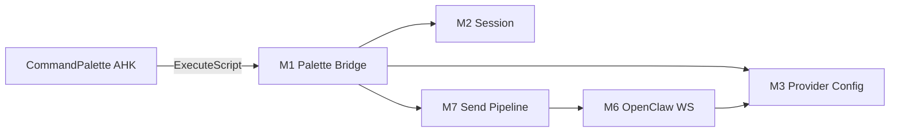

# FloatingToolbarStrip 模块测绘（FTB-0）

本文档为 `html/FloatingToolbarStrip.html`（**~24,501 行 / ~1.05 MB**）的只读边界测绘，供 FTB 绞杀者拆解与 OpenClaw 集成决策使用。

**宿主：** `modules/FloatingToolbar.ahk` → `g_FTB_WV2`（`floatingToolbarHost:ahk` / **S11 `hybrid`**）；S10 `wails` 合壳为 POC 底栏 iframe（退役 AHK `g_FTB_WV2`）  
**CommandPalette 生产依赖：** 是（`runPaletteAgentStream`、`reqOpenClaw`）；hybrid/wails 经 `CommandPalette_DeliverFtbPayload` → Hub inject

**相关：** [`a2ui-architecture-v2.md`](./a2ui-architecture-v2.md)、[`nmer-a2ui-error-v1.md`](./nmer-a2ui-error-v1.md)

---

## 1. 文件概览

| 项 | 值 |
|----|-----|
| 路径 | `html/FloatingToolbarStrip.html` |
| 行数 | ~24,501 |
| 体积 | ~1.08 MB |
| 加载方式 | 单文件 IIFE，无 bundler |
| 对外 window 导出（CP 相关） | 见 §3 |

**结论：** 不是「一个聊天页」，而是 **聊天 + CP 代理 + 多 Provider HTTP + OpenClaw WS + Browser Agent + 设置/UI** 的合体单体。

---

## 2. 模块分区图

```text
FloatingToolbarStrip.html (~24501 lines)
│
├─ M0  Boot / Shell / Toolbar          ~L1–2700
├─ M1  Palette Agent Bridge ★         ~L2670–4900   ← CP 生产关键
├─ M2  Session / History Core          ~L5400–11800
├─ M3  Provider Registry & Setup       ~L1600–1800, ~L11100–14000
├─ M4  HTTP Provider Transport         ~L14000–15200
├─ M5  Browser Agent / CDP             ~L14900–20300
├─ M6  OpenClaw Gateway Client ★       ~L20300–22300  ← CP + Chat 共用
├─ M7  Chat Send Pipeline              ~L22000–24500
└─ M8  HTML/CSS 内联 UI                散布全文件
```

行号为 **测绘估计**（2026-06 仓库快照）。拆分前须用 `rg -n "^  function "` 复核边界。

★ = CommandPalette / OpenClaw 路径直接依赖。

---

## 3. CP 生产接口（不可盲拆）

AHK `CommandPaletteAgentOrchestrator.ahk` 通过 `g_FTB_WV2.ExecuteScript` 调用：

| window 导出 | 行号约 | 用途 |
|-------------|--------|------|
| `runPaletteAgentStream` | ~4564 | CP 任务主入口 |
| `palettePrepareAgentStreamForCard` | ~4540 区 | 预建会话 |
| `paletteEnsureAgentSessionForCard` | ~4130 区 | 卡级会话 |
| `paletteEnsureAgentUserInHistory` | ~4220 区 | 历史注入 |
| `exportPaletteOpenClawGatewayKey` | ~4844 | sessionRef 导出 |
| `exportPaletteLlmForProvider` | ~3526 | Provider 探测 |
| `paletteIsSessionSendingForAgentReqId` | ~3513 | 发送态查询 |

**postMessage 回 AHK（Palette 协议）：**

| type | 方向 | 说明 |
|------|------|------|
| `niuma_palette_agent_chunk` | FTB→AHK | 流式 delta / 状态 |
| `niuma_palette_agent_error` | FTB→AHK | 错误 |
| `niuma_palette_agent_trace` | FTB→AHK | 调试 |
| `host_palette_agent_stream` | AHK→FTB | 派发执行 |

Orchestrator 硬条件：`g_FTB_WV2_Ready && g_FTB_WV2_FrameReady`。

---

## 4. 模块详表

### M0 — Boot / Shell / Toolbar

| 属性 | 内容 |
|------|------|
| 行号约 | 1–2700 |
| 职责 | 启动动画、工具栏按钮、抽屉、主题、debug HUD、`post()` 桥 |
| 关键符号 | `post`, `FTB_MINIMAL_BOOT`, `rebuildToolbarButtons`, `paletteAiHudSet` |
| CP 依赖 | 低（HUD 指示） |
| 拆分风险 | 低 |
| 目标文件 | `html/ftb/shell/boot.js`（未来） |

### M1 — Palette Agent Bridge ★

| 属性 | 内容 |
|------|------|
| 行号约 | 2670–4900 |
| 职责 | CP 专用代理队列、会话绑定、Gateway 执行、late recover、结束通知 |
| 关键符号 | `runPaletteAgentStream`, `runPaletteAgentStreamOnce`, `paletteAgentExecuteViaGateway`, `paletteNotifyPaletteAgentEnd`, `PALETTE_AGENT_WAIT_MS` |
| CP 依赖 | **极高** |
| 耦合 | M2 会话、M6 OpenClaw、M4 `executeModelRequest` |
| 拆分风险 | **高**（须 fixtures + OC 基线） |
| 目标文件 | `html/ftb/palette/palette-agent-bridge.js`（**FTB-1 首选**） |

**内部子流程：**

```text
runPaletteAgentStream
  → paletteEnsureAgentSessionForCard
  → paletteAgentExecuteViaGateway
      → resolvePaletteAgentGatewaySessionKey
      → executeModelRequest / sendChat 路径
          → reqOpenClaw (openclaw provider)
  → poll paletteHydrateAssistantFromGateway
  → paletteNotifyPaletteAgentEnd → postMessage
```

### M2 — Session / History Core

| 属性 | 内容 |
|------|------|
| 行号约 | 5400–11800（散布，与 M3 交叉） |
| 职责 | `sessionById`, `createSessionWithProvider`, 历史 CRUD、持久化 `saveCfg` |
| 关键符号 | `createSessionWithProvider`, `sessionById`, `persistSessions`, `renderSessionTabs` |
| CP 依赖 | 高（palette 会话挂接在同一 session 对象） |
| 拆分风险 | 高 |
| 目标文件 | `html/ftb/chat/session-store.js` |

**注意：** CP agent 与主聊天 **共享 session 对象字段**（`_paletteAgentReqId`, `_paletteOpenClawSessionKey` 等），隔离需显式规则（见 architecture v2 §4.1）。

### M3 — Provider Registry & Setup

| 属性 | 内容 |
|------|------|
| 行号约 | 1600–1800, 11100–14000 |
| 职责 | `P{}` provider 表、API 设置 UI、一键连接、OpenClaw Token |
| 关键符号 | `P`, `providerConfigForNewSession`, `openClawEndpointFromCfg`, `AI_SETUP_PROVIDERS` |
| CP 依赖 | 中（Token/endpoint） |
| 拆分风险 | 中 |
| 目标文件 | `html/ftb/providers/registry.js`, `setup-ui.js` |

### M4 — HTTP Provider Transport

| 属性 | 内容 |
|------|------|
| 行号约 | 14000–15200 |
| 职责 | `reqOpenAI`, `reqClaude`, `reqGemini`, `reqMinimax`, `reqOpenAIMessages`, `hostHttpRequest` |
| 关键符号 | `reqOpenAIMessages`, `applyOpenAiBodyForProvider`, `jsonMode`（可选） |
| CP 依赖 | 中（非 openclaw 的 palette provider） |
| 与 R3 关系 | `jsonMode` **未**接入 palette OpenClaw 路径 |
| 目标文件 | `html/ftb/providers/http-transport.js` |

### M5 — Browser Agent / CDP

| 属性 | 内容 |
|------|------|
| 行号约 | 14900–20300 |
| 职责 | 手机浏览器自动化、快照、本地规划、豆包降级 |
| 关键符号 | `BROWSER_AGENT_*`, `browserAgentTracePush`, `ocStartControlTask` |
| CP 依赖 | **无直接** |
| 内存影响 | 高（大段逻辑常驻） |
| 拆分收益 | **懒加载收益最大** |
| 目标文件 | `html/ftb/agent/browser-agent.js`（`import()` 按需） |

### M6 — OpenClaw Gateway Client ★

| 属性 | 内容 |
|------|------|
| 行号约 | 20300–22300 |
| 职责 | WS 连接 Gateway、`reqOpenClaw`, agent loop UI、tool 事件解析、history 匹配 |
| 关键符号 | `reqOpenClaw`, `ocExtractToolActionFromPayload`, `ocBeginAgentLoopFromChat`, `ocFeedAgentLoopFromOpenClawStream` |
| 协议 | `ws://host:port/?token=` + Gateway chat 帧（**非** OpenAI HTTP） |
| CP 依赖 | **极高** |
| 与 R3 关系 | 产出 **prose 流**，不是 A2UI JSONL |
| 目标文件 | `html/ftb/openclaw/gateway-client.js`（**FTB-2**） |

**tool_call 现状：** `ocExtractToolActionFromPayload` 解析 Gateway tool 帧 → Agent Loop **UI**；经 `palette_agent_tool_event` 可进 CP **status** 块，**不**生成 R3 JSONL。

### M7 — Chat Send Pipeline

| 属性 | 内容 |
|------|------|
| 行号约 | 22000–24500 |
| 职责 | `sendChat`, `executeModelRequest`, 主聊天流式 UI |
| 关键符号 | `sendChat`, `executeModelRequest`, 流式 draft 更新 |
| CP 依赖 | 高（palette 复用同一执行管道） |
| 目标文件 | `html/ftb/chat/send-pipeline.js` |

### M8 — 内联 HTML/CSS

| 属性 | 内容 |
|------|------|
| 位置 | 文件前部 `<style>` + 大量 DOM 模板字符串 |
| 拆分 | 最后阶段；先 JS 逻辑 |

---

## 5. 依赖关系（简化）



---

## 6. 绞杀者路线（与 architecture v2 对齐）

| 阶段 | 动作 | 模块 | 放弃 / 保留 |
|------|------|------|-------------|
| **FTB-0** | 本文档 + OC 基线 | 全图 | 不改行为 |
| **FTB-1** | 抽出 M1 → 独立 JS，FTB 用 `<script src>` | M1 | **已完成** — `palette-agent-bridge.js` v1.2（含 `runPaletteAgentStreamOnce`）；S7 静态门禁通过 |
| **FTB-2** | 抽出 M6 `reqOpenClaw` + endpoint | M6 | 为 Go Adapter 复用 WS 契约文档 |
| **FTB-3** | M5 懒加载；M4/M3 分包 | M5,M4,M3 | 减初始解析内存 |
| **FTB-4** | CP 任务改 `paletteAgent.transport=adapter` | M1 依赖降级 | **不删** FTB 聊天 |
| **FTB-5** | 聊天壳独立或 Wails 第二 Panel | M2,M7,M8 | 远期 |

**非目标：** FTB-1 之前 B3；一次性删除 FTB；把 25k 行迁入 Wails frontend。

---

## 7. 拆分约束（Patch 宪章延伸）

1. 抽出模块必须 **IIFE 或 ESM**，导出与原 `window.*` 名一致  
2. 单 patch 只拆 **一个** 模块  
3. 拆后跑：CP 提交 smoke + `node html/run-palette-fixtures.mjs`  
4. 新增 FTB 相关 fixture 前须记录 OC 基线（见下 §8）  
5. `postMessage` 协议字段 **不变**（除非专票改协议）

---

## 8. OpenClaw 基线验收（FTB-0 必做）

在 FTB 拆分前，用本清单记录**真实状态**（非假设）：

| ID | 检查项 | 通过标准 | 失败错误码 |
|----|--------|----------|------------|
| OC-1 | `g_FTB_WV2_FrameReady` | CP 提交前 true | `BRIDGE_FTB_NOT_READY` |
| OC-2 | Gateway Token | `openClawEndpointFromCfg.ok` | `PROVIDER_OPENCLAW_TOKEN_MISSING` |
| OC-3 | `runPaletteAgentStream` | 存在 | `BRIDGE_FTB_NO_STREAM_FN` |
| OC-4 | chunk 到达 CP | Debug 有 `palette_agent_chunk` | — |
| OC-5 | 四标签闭合率 | 抽样任务 PLAN/REPLY 闭合 | `SEM_PROTOCOL_TAG_UNCLOSED` |
| OC-6 | finalize → R2 | 对比任务有 a2ui 或表格 reply | — |
| OC-7 | sessionRef | 补充追问不串卡 | `SESSION_REF_STALE` |

**产出：** `docs/openclaw-baseline-YYYYMMDD.md`（手工，可后续自动化）。

---

## 9. 内存相关热点

| 热点 | 模块 | 缓解 |
|------|------|------|
| 聊天历史 DOM | M2/M7 | 历史上限、抽屉关闭 `RESET_STATE` |
| 25k 单文件解析 | 全文件 | 分包 + 懒加载 M5 |
| Palette 会话挂主 session | M1/M2 | 卡级字段隔离；结束清 `_paletteAgent*` |
| 双 WebView（FTB+CP） | 宿主 | B3 卸 CP；FTB-4 减 CP→FTB 耦合 |

---

## 10. 测绘待办（FTB-0 后续）

- [ ] `rg -n "window\." FloatingToolbarStrip.html` 全量导出表  
- [ ] `rg -n "^  (async )?function " FloatingToolbarStrip.html` 函数索引  
- [ ] 标注每个 `post({type:` 的消息类型清单  
- [ ] 与 `CommandPaletteAgentOrchestrator.ahk` 双向消息对照表  
- [ ] 运行 OC-1~OC-7 填写 baseline 文档  

---

## 11. 变更记录

| 版本 | 说明 |
|------|------|
| v0.1 | FTB-0 首版测绘：8 模块 + CP 接口 + 绞杀路线 + OC 基线清单 |
