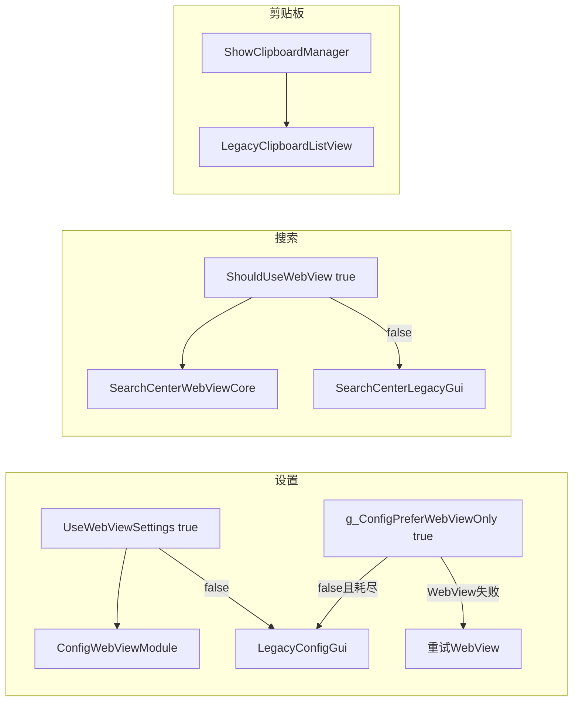

# 模块清单与架构核实（轻量排查）

> 生成依据：仓库实测 + [`牛马.ahk`](../牛马.ahk) / [`tools/ci/Run-MinimalGate.ps1`](../tools/ci/Run-MinimalGate.ps1) 梳理。  
> 统计脚本：[`tools/dev/_module_inventory_stats.py`](../tools/dev/_module_inventory_stats.py)（输出 [`Cache/ci/module_inventory_stats.json`](../Cache/ci/module_inventory_stats.json)）。  
> 相关：[`ci-minimal-gate.md`](ci-minimal-gate.md)、[`nmer-conventions.md`](nmer-conventions.md)。

---

## 核实摘要

| 常见说法 | 核实 | 备注 |
|----------|------|------|
| AHK v2 单体 + ~102 模块 | **基本成立** | `modules/*.ahk` 现 **112** 个；入口 **7474 行 / 323KB**；主脚本 **88** 处 `#Include modules\...` |
| 几乎无 AHK 单元测试 | **成立** | 无 AHK 单测框架；CI 为静态门 + 烟雾/探针；Go/JS 有自动化 |
| LegacyConfigGui 458KB | **成立** | **458KB / 10666 行**（非 ~1.5 万行） |
| SearchCenterWebViewCore 383KB | **略偏差** | **368KB / 10406 行** |
| FloatingToolbar 271KB | **略偏差** | **294KB / 8285 行**（+ WailsHost 860 行 + Router 129 行） |
| 改代码需整应用启动验证 | **大体成立** | 启动时解析全部 `#Include`；无模块热重载 |
| Legacy = 债非归档 | **成立** | 启动即加载；双轨 fallback；`LegacyGuardrails` 为横切基础设施 |
| FTB ≈ 单文件 MVC 三合一 | **方向正确** | 8285 行过程式混合宿主/桥/布局/Chat；无 class 分层 |

**计数口径**：本文「模块数」= `modules/` 下 `.ahk` 文件数（含 `VirtualKeyboardExecCmd.d.ahk` 等）；不含 `lib/ahk/`。若只计主脚本直接 `#Include` 的模块，约 **88** 个；其余经巨型模块间接 `#Include`（如 `FloatingToolbar` → `NiumaMobileBrowser`，`GlobalDragHoleOverlay` → `GlobalDragHoleDecoupled`）。

---

## 表 1：Top 15 巨型模块

| 文件 | KB | 行数 | 主入口 #Include | 职责（一句话） | 主要消费入口 |
|------|-----|------|-----------------|----------------|--------------|
| [`LegacyConfigGui.ahk`](../modules/LegacyConfigGui.ahk) | 458.2 | 10666 | 是 | 原生全屏设置 GUI（`UseWebViewSettings=false` 路径） | [`牛马.ahk`](../牛马.ahk) L5336；`ShowConfigGUI_Core` / `ShowConfigGUI_FallbackCheck` |
| [`SearchCenterWebViewCore.ahk`](../modules/SearchCenterWebViewCore.ahk) | 368.3 | 10406 | 是 | 搜索中心 WebView2 宿主、统一模式、SCWV 消息 | 主脚本 L296；`ShowSearchCenter()` 经 `SearchCenter_ShouldUseWebView()` 分流 |
| [`FloatingToolbar.ahk`](../modules/FloatingToolbar.ahk) | 293.9 | 8285 | 是 | 悬浮工具栏 WebView 宿主、布局、Chat 抽屉、与搜索/截图联动 | 主脚本 L258；[`FloatingToolbarRouter.ahk`](../modules/FloatingToolbarRouter.ahk) |
| [`NiumaMobileBrowser.ahk`](../modules/NiumaMobileBrowser.ahk) | 267.2 | 6684 | 间接 | 移动/内嵌浏览器与 HostObject 注入 | `#Include` 自 `FloatingToolbar.ahk` L7 |
| [`ScreenshotEditorPlugin.ahk`](../modules/ScreenshotEditorPlugin.ahk) | 263.7 | 6247 | 是 | 截图助手 GUI 与编辑流程 | 主脚本 L6454 |
| [`CloudPlayer.ahk`](../modules/CloudPlayer.ahk) | 261.5 | 6692 | 是 | 云播放器 / 异步请求与 stale 守卫 | 主脚本 L243 |
| [`LegacyClipboardListView.ahk`](../modules/LegacyClipboardListView.ahk) | 233.9 | 5361 | 是 | 原生 ListView 剪贴板管理器 | 主脚本 L5337；`ShowClipboardManager()` |
| [`VirtualKeyboardCore.ahk`](../modules/VirtualKeyboardCore.ahk) | 216.5 | 5883 | 是 | 虚拟键盘/CapsLock 和弦核心 | 主脚本 L7360（热键块之后） |
| [`CommandPaletteCore.ahk`](../modules/CommandPaletteCore.ahk) | 212.3 | 5876 | 是 | 命令面板 WebView2 宿主与搜索 | 主脚本 L279 |
| [`GlobalDragHoleDecoupled.ahk`](../modules/GlobalDragHoleDecoupled.ahk) | 199.9 | 5145 | 间接 | 黑洞多窗拓扑（星空 + 交互 HUD） | `#Include` 自 `GlobalDragHoleOverlay.ahk` L3 |
| [`ConfigWebViewModule.ahk`](../modules/ConfigWebViewModule.ahk) | 190.2 | 4584 | 是 | 设置中心 WebView 宿主与 AHK 消息桥 | 主脚本 L7362；`SurfaceIntent_Open("config_webview")` |
| [`GlobalDragHoleOverlay.ahk`](../modules/GlobalDragHoleOverlay.ahk) | 170.1 | 4548 | 是 | 全局划选黑洞 overlay 入口 | 主脚本 L256 |
| [`SelectionSenseCore.ahk`](../modules/SelectionSenseCore.ahk) | 165.3 | 4366 | 是 | 划选感应 → 弱预览黑洞 → 提交面板 | 主脚本 L299 |
| [`ClipboardHistoryPanel.ahk`](../modules/ClipboardHistoryPanel.ahk) | 160.6 | 3986 | 是 | 剪贴板历史 WebView 面板（与 Legacy ListView 并存） | 主脚本 L233；`ShowClipboardHistoryPanel()`（调用面较窄） |
| [`CommandPaletteAgentOrchestrator.ahk`](../modules/CommandPaletteAgentOrchestrator.ahk) | 154.1 | 3816 | 是 | 命令面板 Agent 任务编排 | 主脚本 L282 |

---

## 表 2：Legacy / 双轨路径

### 全局开关（[`牛马.ahk`](../牛马.ahk)）

| 变量 | 默认值 | 作用 |
|------|--------|------|
| `UseWebViewSettings` | `true` (L352) | 设置：`true` → WebView；`false` → `LegacyConfigGui_Show()` |
| `g_ConfigPreferWebViewOnly` | `true` (L355) | WebView 打开失败时**只重试 WebView**，不回落原生设置窗 |
| `SearchCenter_ShouldUseWebView()` | 恒 `true` ([`SearchCenterWebViewCore.ahk`](../modules/SearchCenterWebViewCore.ahk) L768–770) | 搜索：`true` → `SurfaceIntent_OpenSearch`；`false` → 原生 `SearchCenterLegacyGui` 窗体 |

### 分项

| 模块 | 加载方式 | 主路径（当前默认） | Fallback / 仍可达条件 | 删除风险 |
|------|----------|-------------------|----------------------|----------|
| [`LegacyConfigGui.ahk`](../modules/LegacyConfigGui.ahk) | 主 `#Include` L5336 | `UseWebViewSettings=true` → `ConfigWebViewModule` / `SurfaceIntent_Open("config_webview")` | `UseWebViewSettings=false` 直接 `LegacyConfigGui_Show()`；`g_ConfigPreferWebViewOnly=false` 且 WebView 重试耗尽 → L5438 `LegacyConfigGui_Show()` | **高** — 10.7k 行仍编译进进程；关闭 fallback 仍占启动解析成本 |
| [`LegacyClipboardListView.ahk`](../modules/LegacyClipboardListView.ahk) | 主 `#Include` L5337 | **`ShowClipboardManager()` 即此模块**（无并行 WebView 开关） | 托盘/热键/`AutoShowClipboardManager`/`CursorPanelController` 均调 `ShowClipboardManager` | **高** — 剪贴板主 UI 仍依赖；[`ClipboardHistoryPanel.ahk`](../modules/ClipboardHistoryPanel.ahk) 未全面替代 |
| [`LegacyGuardrails.ahk`](../modules/LegacyGuardrails.ahk) | 主 `#Include` L197（早期） | WinHttp/剪贴板等待/焦点请求的横切守卫 | 被 Legacy **与** WebView 模块共同调用（`LegacyGuard_*`） | **高** — 非「旧 GUI」，是活跃基础设施；改名比删除更现实 |
| [`LegacyPromptQuickPadGui.ahk`](../modules/LegacyPromptQuickPadGui.ahk) | 间接：[`AIListPanel.ahk`](../modules/AIListPanel.ahk) L2555 | AI 列表面板原生 ListView 窗体 | 随 `AIListPanel` 显示路径触发 | **中** — 范围限于 Quick-Pad 原生窗 |
| [`SearchCenterLegacyGui.ahk`](../modules/SearchCenterLegacyGui.ahk) | 主 `#Include` L7248 | **`SearchCenter_ShouldUseWebView()` 恒 true** → `ShowSearchCenter()` 开头即 `SurfaceIntent_OpenSearch` 返回 | 仅当改 `SearchCenter_ShouldUseWebView` 为 `false` 时执行 L568+ 原生窗逻辑 | **deprecated（运行时死路径）** — 默认不跑但 3k+ 行仍加载；**禁止扩张** |

---

## 表 3：CI vs 手测矩阵

### `Run-MinimalGate.ps1 -Strict` 实际步骤

| 步骤 | 脚本 | 类型 |
|------|------|------|
| SearchCore Phase1 | [`Run-SearchCoreLifecyclePhase1Suite.ps1`](../tools/ci/Run-SearchCoreLifecyclePhase1Suite.ps1) | 静态（Phase0/1/2）+ AHK 烟雾 + SearchCore 探针/E2E |
| Catch Policy | [`Validate-CatchPolicy.ps1`](../tools/ci/Validate-CatchPolicy.ps1) | 静态：禁止裸 `catch {}` |
| Sql Policy | [`Validate-SqlPolicy.ps1`](../tools/ci/Validate-SqlPolicy.ps1) | 静态：Tier-1 SQL 拼接 |
| WS Policy | [`Validate-WsPolicy.ps1`](../tools/ci/Validate-WsPolicy.ps1) | 静态：Hub token 接线 |
| AHK Launch Matrix | [`TryAhkLaunchMatrix.ps1`](../tools/ci/TryAhkLaunchMatrix.ps1) | 烟雾：AHK 可执行 + 最小 probe 脚本 |

Phase1 套件内另含：[`Validate-SearchCoreLifecycleStatic.ps1`](../tools/ci/Validate-SearchCoreLifecycleStatic.ps1)、[`Run-SearchCoreLifecycleProbe.ps1`](../tools/ci/Run-SearchCoreLifecycleProbe.ps1)、[`Run-SearchCoreRelaunchProbe.ps1`](../tools/ci/Run-SearchCoreRelaunchProbe.ps1)、[`Run-SearchCoreLifecycleE2E.ps1`](../tools/ci/Run-SearchCoreLifecycleE2E.ps1) 等。

### 其他自动化（非 Minimal Gate 默认）

| 区域 | 自动化 | 入口 |
|------|--------|------|
| Go poc / WS | `go test`、WS 策略门 | [`apps/nmer-wails/poc/*_test.go`](../apps/nmer-wails/poc/) |
| SearchCore Go | `*_windows_test.go` | [`searchcore/`](../searchcore/) |
| Palette A2UI | JS reducer fixtures | `node html/run-palette-fixtures.mjs` |
| AsyncGuardrails / Recovery | E2E 探针（可选） | [`RunAsyncGuardrailsE2E.ps1`](../tools/ci/RunAsyncGuardrailsE2E.ps1)、[`RunRecoveryProbeE2E.ps1`](../tools/ci/RunRecoveryProbeE2E.ps1) |
| AHK 片段探针 | 手工/临时 | [`tools/scratch/`](../tools/scratch/)、[`lib/dev/`](../lib/dev/) |

### 区域覆盖 vs 手测

| 区域 | 自动化覆盖 | 仍需手测 |
|------|------------|----------|
| AHK 语法/可启动 | 烟雾（非业务断言） | 任意 UI/WebView 功能回归 |
| SearchCore 生命周期 | 静态 + relaunch/shutdown 探针 | 全盘索引、搜索 UI、与 SCWV 联调 |
| Go Hub / A2UI | 单测 + fixtures | 二进制部署版本、真机 WebView 宿主 |
| 设置 / LLM / iframe 桥 | **无** | provider 测试、父子壳 postMessage、密钥传递 |
| Legacy 设置 fallback | **无** | `UseWebViewSettings=false` / `g_ConfigPreferWebViewOnly=false` |
| Legacy 直调扩散 | `Validate-LegacyBypass.ps1`（`-Strict`） | fallback 路径手测、白名单维护 |
| Legacy 剪贴板 ListView | **无** | 复制触发、FTS、CapsLock+C 标签 |
| FloatingToolbar / Chat | **无** | 多宿主、抽屉、截图延迟、SearchCenter 联动 |
| 命令面板 Agent | **无** | 流式、provider 直连、Wails 合壳 |
| 黑洞 / 划选 | **无** | 多显示器、手势、overlay 穿透 |

---

## 表 4：FloatingToolbar 逻辑区块（拆分边界草稿）

[`FloatingToolbar.ahk`](../modules/FloatingToolbar.ahk) 共 **230** 个 `FloatingToolbar_*` 函数（按前缀粗分，**未改代码**）。

| 区块 | 函数约数 | 代表函数 | 日后拆分建议 |
|------|----------|----------|--------------|
| **misc**（杂项状态/场景/恢复） | 136 | `FloatingToolbar_SoftRecoverVisible`、`FloatingToolbar_IsNiumaHandoffActive` | 最后拆；先理清依赖 |
| **chat_ttyd_bridge** | 26 | `FloatingToolbar_GetChatWv2`、`FloatingToolbar_OnChatReady`、`FloatingToolbar_PushNodeStatus` | 优先拆出 → `FloatingToolbarChat.ahk` |
| **show_hide**（显隐/启动） | 22 | `FloatingToolbar_UseMinimalBoot`、`FloatingToolbar_FinishRevealBoot` | 与 `FloatingToolbarWailsHost` 协调 |
| **webview_lifecycle** | 20 | `FloatingToolbar_OnWebViewCreated`、`FloatingToolbar_DisposeAhkWebViewIfRetired` | 可并入 WailsHost 或独立 `FloatingToolbarWebView.ahk` |
| **layout_dpi** | 14 | `FloatingToolbar_DpiFactor`、`FloatingToolbar_ClampWindowToWorkArea` | 独立 `FloatingToolbarLayout.ahk`（低耦合） |
| **search_center** | 11 | `FloatingToolbar_RecoverSearchCenterFromToolbar`、`FloatingToolbar_RequestSearchByKeyword` | 依赖 SCWV；与 SearchCenter 契约一起动 |
| **screenshot** | 1 | `FloatingToolbar_DeferredScreenshot` | 逻辑在插件侧更多；保持薄包装即可 |

已外拆：

- [`FloatingToolbarRouter.ahk`](../modules/FloatingToolbarRouter.ahk) — AHK / Wails / Hybrid 宿主路由  
- [`FloatingToolbarWailsHost.ahk`](../modules/FloatingToolbarWailsHost.ahk) — Wails 合壳宿主  

---

## 结论与建议

### 可对外陈述（有实测支撑）

- **AHK v2 单体**：单进程、单入口、启动时加载大量 `#Include`；巨型文件 Top 3 合计约 **2.3 万行**（Config + SCWV + FTB）。
- **几乎无 AHK 单元测试**：CI 以策略门 + 烟雾/探针为主；业务逻辑回归依赖手测。
- **Legacy 是双轨而非归档**：默认多走 WebView，但 Legacy 源码仍编译进二进制；`LegacyGuardrails` 是共享基础设施。
- **Legacy 冻结**：`Validate-LegacyBypass.ps1` 拦非 Legacy 模块新增 `LegacyConfigGui_Show` / `ShowClipboardManager` 直调（见 `tools/ci/legacy-bypass-allowlist.txt`）。
- **错误诊断在改进**：LLM/网络类已能区分桥接 vs HTTP（见 `studio_llm_test.log` 与 `LlmApiPing` 分阶段诊断）。

### 数字请用本文实测

- 模块数：**112**（非 102）  
- `LegacyConfigGui`：**10666 行**（非 ~15000）  
- `FloatingToolbar`：**294KB**（非 271KB）

### 近期不值得做

- 为「删干净 Legacy」大改稳定路径（fallback 与 `LegacyGuardrails` 牵连广）
- 为「理论纯粹」拆分 `FloatingToolbar` / `LegacyConfigGui` 全盘重构
- 为追模块数精确到 102 做文件挪动

### 近期值得做

- **新功能不进 Top 15 巨型文件**；优先新模块或已外拆的 Router/Host/Provider 层
- **新 WebView 消息 type** 对齐 [`ConfigWebViewModule`](config-inventory.md) / [`llm-provider-contract.md`](llm-provider-contract.md)，避免第三套协议
- **关键契约加自动化**：Palette fixtures 模式可复制到 settings-bridge 或 `LlmApiPing` 静态门
- 手测前跑 [`Run-MinimalGate.ps1 -Strict`](ci-minimal-gate.md) 作最低门禁

---

*文档版本：与仓库 `modules/` 2026-06 实测一致；行数/KB 随提交漂移，可重跑 `tools/dev/_module_inventory_stats.py` 刷新表 1。*
