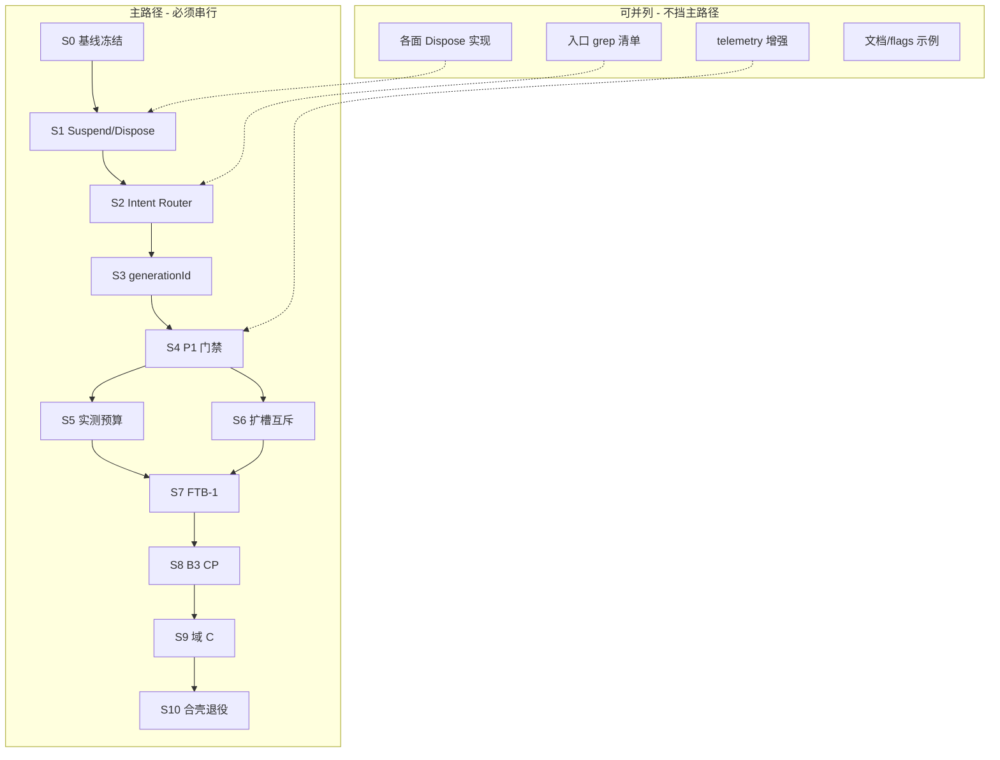

# SurfaceManager 执行步骤计划

> 总目标：Manager 从**观测者**升级为**控制者**——内存可测下降、切换可回滚、迁移可退回，最终收敛到 1～2 个受控 WebView + Wails Shell。

---

## 一、总目标与成功标准

| 维度 | 终态标准 | 当前差距 |
|------|----------|----------|
| **内存** | 空载 scoped WebView2 总和显著低于预热时代（本机目标 <5GB，以 `capture-memory-baseline.ps1` 实测为准） | Hide 不释放 renderer，空载仍偏高 |
| **控制** | 所有 Show/Hide/Dispose 经 Intent Router；registry 为唯一真相源 | 七面内嵌 Request，模块互调旁路多 |
| **安全** | 切换失败可 ABORT 恢复；B3 每步可 `rollback.legacySurfaceLifecycle` | 无 generationId，互斥 Hide 不可逆 |
| **架构** | CP/FTB/Search 逐步合入 `apps/nmer-wails/`；旧宿主可删 | Wails 仍为 POC |

**硬门禁（未过则禁止后续）：**

```
P0 观测层 ──► P1 控制者三件套 ──► P1 门禁复测 ──► P2 enforce ──► P3 B3 迁移
                  │                      │
                  └ 缺任一件不得开 enforceBudget / B3
```

---

## 二、阶段总览（主次关系）



| 阶段 | 性质 | 说明 |
|------|------|------|
| **S0** | 前置 | 冻结观测基线，不改行为 |
| **S1～S3** | **主路径·阻塞** | 控制者三件套，严格顺序 |
| **S4** | **主路径·闸门** | 三件验收，不过不晋级 |
| **S5～S6** | 主路径·可略并列 | 均依赖 S4；S5 优先于 B3 |
| **S7～S10** | 主路径·串行 | 迁移链，每步可回滚 |
| **并列任务** | 辅助 | 加速 S1/S2/S4，不替代门禁 |

---

## 三、S0 — 基线冻结（1 天）

**主次**：次（准备），但应先做。

### 方案

1. 确认 [`local/nmer-flags.json`](../local/nmer-flags.json)：`interceptWarmup:true`，`enforceBudget:false`，`enabled:false`。
2. 重载牛马后跑：
   - `tools/a2ui-diagnostics/capture-memory-baseline.ps1`
   - `tools/a2ui-diagnostics/Summarize-SurfaceRuntime.ps1`
3. 记录：`emptyLoadPrivateMiB`、`webview2_count`、`surface_runtime.ndjson` 事件类型分布。
4. grep 产出**旁路清单**（直调 `SCWV_Show` / `CP_Show` / `CommandPalette_Show` 的文件与行）。

### 落地目标

- [ ] `Cache/debug/a2ui_memory_baseline.json`（或等价输出）存档为 **P1 前对照组**
- [ ] `docs/surface-intent-bypass-inventory.md`（或在 issue 中）列出全部入口旁路，供 S2 消化

### 并列可做

- 更新 [`docs/nmer-flags.example.json`](../docs/nmer-flags.example.json) 注释：P1 前勿开 `enforceBudget`

---

## 四、S1 — Suspend/Dispose 契约（主路径第 1 步，约 3～5 天）

**主次**：**主·阻塞**。S2/S3 依赖本步 executor 存在；内存下降依赖 Dispose 真释放。

### 方案

#### 1.1 契约定义（[`SurfaceRuntimeManager.ahk`](../modules/SurfaceRuntimeManager.ahk)）

| 操作 | Registry 状态 | 行为 |
|------|---------------|------|
| `Suspend` | `ACTIVE → SUSPENDED` | 调 `*_Hide()` + `WebView2_NotifyHidden`；**保留** `g_*_WV2` |
| `Dispose` | `* → ABSENT` | 销毁 WebView2 控件、Destroy GUI、清空 `g_*_WV2`/`g_*_Ready`；记 `ObserveClose` |
| `Open` | `ABSENT/SUSPENDED → CREATING → ACTIVE` | 现有 `*_Init` + `*_Show` |

新增：

- `SurfaceExecutor_Suspend(surfaceId)`
- `SurfaceExecutor_Dispose(surfaceId)`
- `SurfaceIntent_Dispose` 的底层实现（S2 再挂路由）

#### 1.2 各面实现 `*_Dispose`（**可并列**，按面拆分 PR）

| Surface | 模块 | 现状 | Dispose 要点 |
|---------|------|------|--------------|
| `clipboard_panel` | [`ClipboardPanelCore.ahk`](../modules/ClipboardPanelCore.ahk) | Hide 仅 NotifyHidden | Destroy Gui + 清 `g_CP_WV2` |
| `prompt_quick_pad` | [`PromptQuickPadCore.ahk`](../modules/PromptQuickPadCore.ahk) | 同上 | 同上模式 |
| `virtual_keyboard` | [`VirtualKeyboardCore.ahk`](../modules/VirtualKeyboardCore.ahk) | 同上 | 同上模式 |
| `config_webview` | [`ConfigWebViewModule.ahk`](../modules/ConfigWebViewModule.ahk) | Close 不完全释放 | 对齐 Config host teardown |
| `search_center` | [`SearchCenterWebViewCore.ahk`](../modules/SearchCenterWebViewCore.ahk) | 有 hard close 路径 (~1406) | 抽出 `SCWV_Dispose` 复用 teardown |
| `command_palette` | [`CommandPaletteCore.ahk`](../modules/CommandPaletteCore.ahk) | 无 Dispose | 新增，参考 SCWV |
| `floating_toolbar` | [`FloatingToolbar.ahk`](../modules/FloatingToolbar.ahk) | resident | **仅 tray/预算压力时 Dispose**；日常 Suspend |

建议顺序：**secondary 四面先打通** → **search_center** → **command_palette** → **FTB 最后**（resident 策略特殊）。

#### 1.3 改造 `SurfaceManager_HideSurface`

- 预算/槽位冲突：默认 `Suspend`
- 显式 `reason=budget_pressure|tray|dispose`：`Dispose`

### 落地目标

- [ ] 7 个 WebView 面均有可测 `*_Dispose`，Registry 状态 `ABSENT`
- [ ] 手动：打开 CP → `SurfaceExecutor_Dispose("clipboard_panel")` → scoped `webview2_count` **至少减 1**
- [ ] `surface_runtime.ndjson` 出现 `state: ABSENT` + `meta.entry: *_Dispose`
- [ ] **不破坏**现有 `*_Show` 快路径（SUSPENDED 后 Show 仍可复热）

### 并列可做

- telemetry：`Dispose` 事件附带 dispose 前/后 scoped count（调用 baseline 脚本或轻量计数）
- FTB resident 策略文档化（何时 Suspend vs Dispose）

### 不在此步做

- 改热键入口（属 S2）
- 开 `enforceBudget`（属 S5）

---

## 五、S2 — Intent Router（主路径第 2 步，约 3～4 天）

**主次**：**主·阻塞**。依赖 S1 executor；为 S3 提供唯一事务入口。

### 方案

#### 2.1 新增 API（建议同文件或 `SurfaceIntentRouter.ahk`）

```ahk
SurfaceIntent_Open(surfaceId, meta := 0)   ; meta: reason, triggerSource, ...
SurfaceIntent_Close(surfaceId, meta := 0)  ; → Suspend
SurfaceIntent_Dispose(surfaceId, meta := 0)
```

内部流程：

1. `SurfaceManager_Request` +（S3 接入后）`transaction BEGIN`
2. 冲突处理 → `SurfaceExecutor_Suspend/Dispose`
3. 调对应 `*_Show` executor
4. 返回 `requestId`（S3 返回 `generationId`）

#### 2.2 Executor 私有化

- `*_Show` / `*_Hide` 改名为 `*_Show_Exec` / `*_Hide_Exec`（或 `#Requires` 注释 + 仅 Router 调用）
- 模块内删除 `SurfaceManager_Request`（上移到 Router）

#### 2.3 入口迁移（**可并列**，按文件拆 PR）

| 优先级 | 文件 | 直调示例 | 改为 |
|--------|------|----------|------|
| P0 | [`牛马.ahk`](../牛马.ahk) | `CP_Show()` | `SurfaceIntent_Open("clipboard_panel", ...)` |
| P0 | [`FloatingToolbar.ahk`](../modules/FloatingToolbar.ahk) | unified_open, `CP_Show` | Intent |
| P0 | [`ClipboardPanelCore.ahk`](../modules/ClipboardPanelCore.ahk) | redirect → `SCWV_Show` | Intent open search_center |
| P1 | [`CursorPanelController.ahk`](../modules/CursorPanelController.ahk) | `CommandPalette_Show` | Intent |
| P1 | [`CapsLockDynamicHotkey.ahk`](../modules/CapsLockDynamicHotkey.ahk) | `CP_Show` | Intent |
| P1 | [`TrayMenuManager.ahk`](../modules/TrayMenuManager.ahk) | `CP_Show` | Intent |
| P2 | [`WailsWhisperVoice.ahk`](../modules/WailsWhisperVoice.ahk) | `CommandPalette_Show` | Intent |
| P2 | [`GlobalDragHoleDecoupled.ahk`](../modules/GlobalDragHoleDecoupled.ahk) | `CP_Show` | Intent |

模块**内部**自调用（如 `SCWV_Show` 在 SCWV 文件内 recover）暂保留，但须经 Router 包装一层。

#### 2.4 Flags

- `Nmer_SurfaceManagerRouteIntents()`：false 时 Router 委托旧路径（灰度）

### 落地目标

- [ ] 生产路径 grep：**无**跨模块 `SCWV_Show`/`CP_Show`/`CommandPalette_Show`（inventory 清单清零）
- [ ] 热键开 Search / FTB unified_open / Clipboard 重定向均走 Intent
- [ ] `surface_runtime.ndjson` 的 `request.source` 统一为 `SurfaceIntent_Open` 等
- [ ] `routeIntents:false` 可一键回退

### 并列可做

- [`Summarize-SurfaceRuntime.ps1`](../tools/a2ui-diagnostics/Summarize-SurfaceRuntime.ps1) 增加 intent 来源统计

---

## 六、S3 — generationId 事务（主路径第 3 步，约 2～3 天）

**主次**：**主·阻塞**。依赖 S2 唯一入口；S4 门禁核心。

### 方案

#### 3.1 数据结构

```ahk
global g_SurfaceRuntime_GenerationSeq := 0
global g_SurfaceRuntime_ActiveTransaction := 0  ; Map: genId, target, pendingRestores[], phase
```

- `requestId` = 单 surface 单次操作（`search_center#42`）
- `generationId` = 一次完整 open 事务（全局 `gen-43`）

#### 3.2 状态机

```
BEGIN(gen)
  → 记录 pendingRestores[]（冲突面：surfaceId, wasActive, wasVisible）
  → Suspend 冲突面
  → 启动 target Show（携带 gen）
COMMIT(gen)
  → 清空 pending；晚到回调 gen≠active 则丢弃
ABORT(gen, reason)
  → 对 pending 中 wasActive 的面 Intent_Open 恢复
  → 目标面若已半开则 Dispose
```

#### 3.3 接入点

- `SurfaceIntent_Open` 开头 `BEGIN`；Show 成功回调 `COMMIT`；超时/Init 失败 `ABORT`
- 各面 `*_Show_Exec` 接受 `meta.generationId`，异步完成时回传 Router

#### 3.4 日志

- `transaction_begin` / `transaction_commit` / `transaction_abort` 写入 ndjson

### 落地目标

- [ ] 注入 Show 失败（如断网 Init）：冲突面**自动恢复**可见
- [ ] 快速连按 Search：过期 generation 回调被丢弃，无双开闪屏
- [ ] ndjson 可串起单次切换的 begin→commit/abort 全链
- [ ] 截图挂起 `token` 与 generationId **不混用**（文档说明边界）

### 不在此步做

- 扩大 enforceSlots 覆盖面（S6，需 generationId 已稳）

---

## 七、S4 — P1 门禁（主路径闸门，约 1～2 天）

**主次**：**主·必须通过**。S5/S6/S7 前置条件。

### 方案

1. [`local/nmer-flags.json`](../local/nmer-flags.json)：`enabled: true`，`routeIntents: true`（新增），保持 `enforceBudget: false`
2. 功能回归矩阵：

| 场景 | 预期 |
|------|------|
| 启动空载 | 无四连 warmup_step |
| Caps+CP | 正常 |
| Search 热键 | 正常，intent 有 generationId |
| CP↔SC 切换 | 失败可 abort |
| Clipboard unified | 重定向 search intent |
| Config 延迟打开 | 正常 |
| tray 模式 | FTB Dispose 策略符合设计 |

3. 内存复测：`capture-memory-baseline.ps1` 对比 S0
4. `Summarize-SurfaceRuntime.ps1`：有 dispose + transaction 事件

### 落地目标

- [ ] **门禁签字**：空载内存较 S0 下降（具体阈值写进 baseline json）
- [ ] Dispose 后 webview2_count 可复现下降
- [ ] 明确记录：**未过门禁不得进入 S5/S7**

---

## 八、S5 — 实测预算 + enforceBudget（P2 主步，约 2 天）

**主次**：主路径，与 S6 可略并列；**必须在 S4 之后**。

### 方案

1. 用 S0/S4 baseline 反填 `SurfaceManager_BudgetPolicy`：
   - toolbar：totalWebview = 空载实测 + 1 余量
   - hole/tray/bubble 各档单独测
2. `enforceBudget: true` 灰度：超限调用 `SurfaceIntent_Dispose`（**禁止**仅 Hide）
3. 双开 SC+CP 压测：触发回收后内存回落

### 落地目标

- [ ] BudgetPolicy 数字有实测出处（注释链到 baseline json 时间戳）
- [ ] 超限时 ndjson 有 `budget_plan` + 后续 `dispose` 事件
- [ ] 双开场景内存可控，无「越收越高」

---

## 九、S6 — 扩大槽位互斥（P2 辅主步，可与 S5 交错，约 1～2 天）

**主次**：次于 S5 的内存证明，但与 S5 无强依赖；**必须在 S3 之后**。

### 方案

1. `SurfaceManager_ShouldEnforceSlotsForRequest` 扩展：
   - `external_hotkey`（Search 热键）
   - `internal_toolbar`（unified_open_*）
2. 新增 **overlay** 组：GDHO / 截图 overlay（与 primary 互斥）
3. 所有冲突 Hide 走 generationId，失败 ABORT

### 落地目标

- [ ] Search 热键打开时，CP 自动 Suspend；失败可恢复
- [ ] open_plan 中 `shouldEnforce: 1` 覆盖热键场景
- [ ] overlay 不与 primary 同时 ACTIVE

---

## 十、S7～S10 — Wails 迁移链（P3，仅 S4+S5 通过后）

**主次**：主路径后半段，**严格串行**。

### S7 — FTB-1 门禁（约 3～5 天）

| 项 | 内容 |
|----|------|
| 方案 | 按 [`ftb-module-map.md`](ftb-module-map.md) 抽离 `runPaletteAgentStreamOnce` |
| 目标 | B3 可复用 palette bridge，FTB 与 CP 解耦 |

### S8 — B3 CommandPalette 迁入 Wails（约 1～2 周）

| 项 | 内容 |
|----|------|
| 方案 | CP UI → [`apps/nmer-wails/`](../apps/nmer-wails/)；AHK 保留热键与 `SurfaceIntent_Open("command_palette")`；侧车 exe 由 Router 管理生命周期 |
| 目标 | `g_CmdPal_WV2` 可卸；`rollback.legacySurfaceLifecycle:true` 一键回 AHK CP |
| 验收 | B3 前后各跑 baseline；generationId 切换 CP 源不崩 |

### S9 — 域 C 原生化 MVP（约 2～4 周）

| 项 | 内容 |
|----|------|
| 方案 | SearchCenter + Config 原生/单 Shell；消灭 SCWV/Config 常驻 WebView |
| 目标 | secondary 面 Dispose 后不再重建 WebView |
| 并列 | Bubble / VK / Hole Preview 原生可拆独立 stream，但应在 S8 稳定后 |

### S10 — FTB 合壳 + 退役旧宿主（约 1～2 周）

| 项 | 内容 |
|----|------|
| 方案 | FTB 懒加载进 Wails Shell；删除独立 WebView 宿主文件 |
| 目标 | 全应用 ≤2 个受控 WebView；旧 `*WebViewCore*` 宿主删除或仅留 rollback 分支 |

---

## 十一、并列任务一览（不替代主路径）

| 任务 | 可与哪步并列 | 产出 |
|------|--------------|------|
| 旁路 grep 清单维护 | S0～S2 | inventory 文档 |
| 各面 `*_Dispose` 实现 | S1 内部并列 | 7 个 PR |
| 入口改 Intent | S2 内部并列 | 按文件 PR |
| telemetry 增强（pid/gen） | S1～S4 | 脚本/ndjson 字段 |
| `nmer-flags.example.json` 文档 | 任意 | 防误开 enforce |
| VK/剪贴板/搜索框 bugfix | 任意 | 已做部分，与 P1 正交 |

---

## 十二、风险与回退

| 风险 | 缓解 |
|------|------|
| Dispose 后冷启动慢 | SUSPENDED 作默认 Close；Dispose 仅预算/tray/显式 |
| Intent 漏改入口 | S0 inventory + S2 结束 grep CI（可选脚本） |
| generationId 竞态 | 单线程 AHK + 过期 gen 丢弃；ndjson 审计 |
| B3 回不去 | 每步保留 `legacySurfaceLifecycle`；S3 ABORT 验证通过后再迁 |
| 内存仍高 | 未过 S4 禁止 B3；enforce 必须走 Dispose |

**回退开关**（[`local/nmer-flags.json`](../local/nmer-flags.json)）：

```json
"surfaceManager": {
  "enabled": false,
  "routeIntents": false,
  "enforceBudget": false,
  "enforceSlots": false
},
"rollback": { "legacySurfaceLifecycle": true }
```

---

## 十三、推荐执行顺序（一页纸）

```
周次   主路径                              并列
────   ─────────────────────────────────   ─────────────
W1     S0 基线 + S1 契约 + secondary Dispose   inventory / telemetry
W2     S1 primary Dispose + S2 Router 启动      入口 PR 批次 1
W3     S2 Router 收尾 + S3 generationId         入口 PR 批次 2
W4     S3 稳定 + S4 门禁复测                    flags 文档
       ─── 未过门禁止 ───
W5     S5 enforceBudget + S6 扩槽               baseline 填 policy
W6+    S7 FTB-1 → S8 B3 → S9 域 C → S10 合壳   原生化可拆 stream
```

---

## 十四、当前状态快照（2026-06-09）

| 步骤 | 状态 |
|------|------|
| S0 | **完成** — `Cache/debug/pre-p1/manifest.json`、`docs/surface-intent-bypass-inventory.md`；内存基线需在重载牛马后复采 |
| S1 | **完成** — Dispose A/B 验证通过（FTB −1103 MiB scoped WV2） |
| S2 | **基本完成** — Executor 入口自动路由 Close/Open；`intent_close` 补测待验证 |
| S3 | 未开始 |
| S4～S10 | 未开始 |

**下一步行动**：重载牛马 → 手动 `SurfaceExecutor_Dispose("clipboard_panel")` 验证 webview2_count → 推进 S1 primary（SCWV/CP）→ S2 Intent Router。
