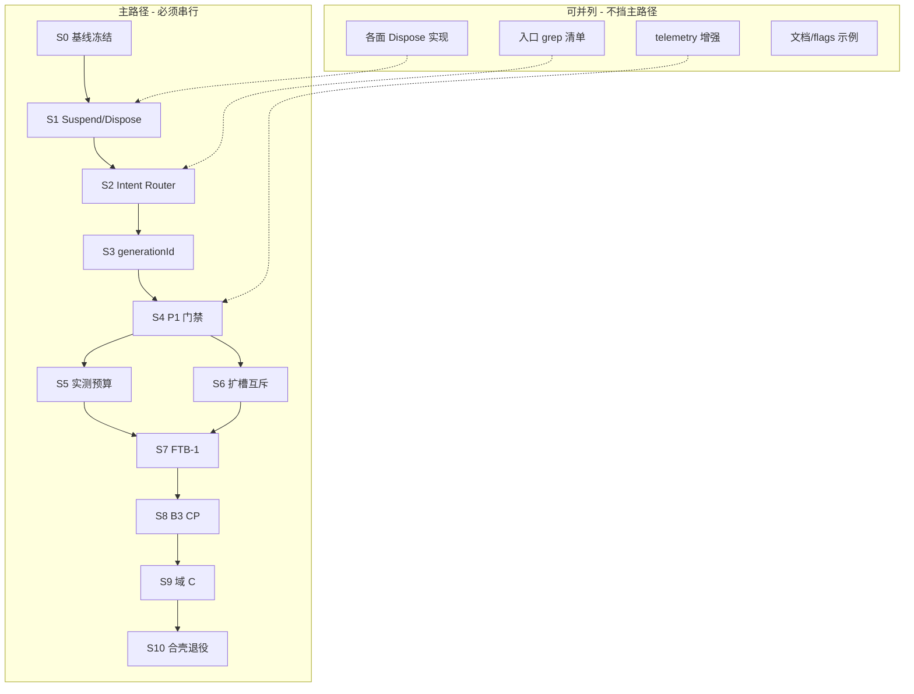

# SurfaceManager 执行步骤计划

> 总目标：Manager 从**观测者**升级为**控制者**——内存可测下降、切换可回滚、迁移可退回，最终收敛到 1～2 个受控 WebView + Wails Shell。

---

## 一、总目标与成功标准

| 维度 | 终态标准 | 当前差距 |
|------|----------|----------|
| **内存** | 空载 scoped WebView2 总和显著低于预热时代（本机目标 <5GB，以 `capture-memory-baseline.ps1` 实测为准） | Hide 不释放 renderer，空载仍偏高 |
| **控制** | 所有 Show/Hide/Dispose 经 Intent Router；registry 为唯一真相源 | 七面内嵌 Request，模块互调旁路多 |
| **安全** | 切换失败可 ABORT 恢复；B3 每步可 `rollback.legacySurfaceLifecycle` | 无 generationId，互斥 Hide 不可逆 |
| **架构** | CP/FTB/Search 逐步合入 `apps/nmer-wails/`；旧宿主可删 | Wails 仍为 POC |

**硬门禁（未过则禁止后续）：**

```
P0 观测层 ──► P1 控制者三件套 ──► P1 门禁复测 ──► P2 enforce ──► P3 B3 迁移
                  │                      │
                  └ 缺任一件不得开 enforceBudget / B3
```

---

## 二、阶段总览（主次关系）



| 阶段 | 性质 | 说明 |
|------|------|------|
| **S0** | 前置 | 冻结观测基线，不改行为 |
| **S1～S3** | **主路径·阻塞** | 控制者三件套，严格顺序 |
| **S4** | **主路径·闸门** | 三件验收，不过不晋级 |
| **S5～S6** | 主路径·可略并列 | 均依赖 S4；S5 优先于 B3 |
| **S7～S10** | 主路径·串行 | 迁移链，每步可回滚 |
| **并列任务** | 辅助 | 加速 S1/S2/S4，不替代门禁 |

---

## 三、S0 — 基线冻结（1 天）

**主次**：次（准备），但应先做。

### 方案

1. 确认 [`local/nmer-flags.json`](../local/nmer-flags.json)：`interceptWarmup:true`，`enforceBudget:false`，`enabled:false`。
2. 重载牛马后跑：
   - `tools/a2ui-diagnostics/capture-memory-baseline.ps1`
   - `tools/a2ui-diagnostics/Summarize-SurfaceRuntime.ps1`
3. 记录：`emptyLoadPrivateMiB`、`webview2_count`、`surface_runtime.ndjson` 事件类型分布。
4. grep 产出**旁路清单**（直调 `SCWV_Show` / `CP_Show` / `CommandPalette_Show` 的文件与行）。

### 落地目标

- [ ] `Cache/debug/a2ui_memory_baseline.json`（或等价输出）存档为 **P1 前对照组**
- [ ] `docs/surface-intent-bypass-inventory.md`（或在 issue 中）列出全部入口旁路，供 S2 消化

### 并列可做

- 更新 [`docs/nmer-flags.example.json`](../docs/nmer-flags.example.json) 注释：P1 前勿开 `enforceBudget`

---

## 四、S1 — Suspend/Dispose 契约（主路径第 1 步，约 3～5 天）

**主次**：**主·阻塞**。S2/S3 依赖本步 executor 存在；内存下降依赖 Dispose 真释放。

### 方案

#### 1.1 契约定义（[`SurfaceRuntimeManager.ahk`](../modules/SurfaceRuntimeManager.ahk)）

| 操作 | Registry 状态 | 行为 |
|------|---------------|------|
| `Suspend` | `ACTIVE → SUSPENDED` | 调 `*_Hide()` + `WebView2_NotifyHidden`；**保留** `g_*_WV2` |
| `Dispose` | `* → ABSENT` | 销毁 WebView2 控件、Destroy GUI、清空 `g_*_WV2`/`g_*_Ready`；记 `ObserveClose` |
| `Open` | `ABSENT/SUSPENDED → CREATING → ACTIVE` | 现有 `*_Init` + `*_Show` |

新增：

- `SurfaceExecutor_Suspend(surfaceId)`
- `SurfaceExecutor_Dispose(surfaceId)`
- `SurfaceIntent_Dispose` 的底层实现（S2 再挂路由）

#### 1.2 各面实现 `*_Dispose`（**可并列**，按面拆分 PR）

| Surface | 模块 | 现状 | Dispose 要点 |
|---------|------|------|--------------|
| `clipboard_panel` | [`ClipboardPanelCore.ahk`](../modules/ClipboardPanelCore.ahk) | Hide 仅 NotifyHidden | Destroy Gui + 清 `g_CP_WV2` |
| `prompt_quick_pad` | [`PromptQuickPadCore.ahk`](../modules/PromptQuickPadCore.ahk) | 同上 | 同上模式 |
| `virtual_keyboard` | [`VirtualKeyboardCore.ahk`](../modules/VirtualKeyboardCore.ahk) | 同上 | 同上模式 |
| `config_webview` | [`ConfigWebViewModule.ahk`](../modules/ConfigWebViewModule.ahk) | Close 不完全释放 | 对齐 Config host teardown |
| `search_center` | [`SearchCenterWebViewCore.ahk`](../modules/SearchCenterWebViewCore.ahk) | 有 hard close 路径 (~1406) | 抽出 `SCWV_Dispose` 复用 teardown |
| `command_palette` | [`CommandPaletteCore.ahk`](../modules/CommandPaletteCore.ahk) | 无 Dispose | 新增，参考 SCWV |
| `floating_toolbar` | [`FloatingToolbar.ahk`](../modules/FloatingToolbar.ahk) | resident | **仅 tray/预算压力时 Dispose**；日常 Suspend |

建议顺序：**secondary 四面先打通** → **search_center** → **command_palette** → **FTB 最后**（resident 策略特殊）。

#### 1.3 改造 `SurfaceManager_HideSurface`

- 预算/槽位冲突：默认 `Suspend`
- 显式 `reason=budget_pressure|tray|dispose`：`Dispose`

### 落地目标

- [ ] 7 个 WebView 面均有可测 `*_Dispose`，Registry 状态 `ABSENT`
- [ ] 手动：打开 CP → `SurfaceExecutor_Dispose("clipboard_panel")` → scoped `webview2_count` **至少减 1**
- [ ] `surface_runtime.ndjson` 出现 `state: ABSENT` + `meta.entry: *_Dispose`
- [ ] **不破坏**现有 `*_Show` 快路径（SUSPENDED 后 Show 仍可复热）

### 并列可做

- telemetry：`Dispose` 事件附带 dispose 前/后 scoped count（调用 baseline 脚本或轻量计数）
- FTB resident 策略文档化（何时 Suspend vs Dispose）

### 不在此步做

- 改热键入口（属 S2）
- 开 `enforceBudget`（属 S5）

---

## 五、S2 — Intent Router（主路径第 2 步，约 3～4 天）

**主次**：**主·阻塞**。依赖 S1 executor；为 S3 提供唯一事务入口。

### 方案

#### 2.1 新增 API（建议同文件或 `SurfaceIntentRouter.ahk`）

```ahk
SurfaceIntent_Open(surfaceId, meta := 0)   ; meta: reason, triggerSource, ...
SurfaceIntent_Close(surfaceId, meta := 0)  ; → Suspend
SurfaceIntent_Dispose(surfaceId, meta := 0)
```

内部流程：

1. `SurfaceManager_Request` +（S3 接入后）`transaction BEGIN`
2. 冲突处理 → `SurfaceExecutor_Suspend/Dispose`
3. 调对应 `*_Show` executor
4. 返回 `requestId`（S3 返回 `generationId`）

#### 2.2 Executor 私有化

- `*_Show` / `*_Hide` 改名为 `*_Show_Exec` / `*_Hide_Exec`（或 `#Requires` 注释 + 仅 Router 调用）
- 模块内删除 `SurfaceManager_Request`（上移到 Router）

#### 2.3 入口迁移（**可并列**，按文件拆 PR）

| 优先级 | 文件 | 直调示例 | 改为 |
|--------|------|----------|------|
| P0 | [`牛马.ahk`](../牛马.ahk) | `CP_Show()` | `SurfaceIntent_Open("clipboard_panel", ...)` |
| P0 | [`FloatingToolbar.ahk`](../modules/FloatingToolbar.ahk) | unified_open, `CP_Show` | Intent |
| P0 | [`ClipboardPanelCore.ahk`](../modules/ClipboardPanelCore.ahk) | redirect → `SCWV_Show` | Intent open search_center |
| P1 | [`CursorPanelController.ahk`](../modules/CursorPanelController.ahk) | `CommandPalette_Show` | Intent |
| P1 | [`CapsLockDynamicHotkey.ahk`](../modules/CapsLockDynamicHotkey.ahk) | `CP_Show` | Intent |
| P1 | [`TrayMenuManager.ahk`](../modules/TrayMenuManager.ahk) | `CP_Show` | Intent |
| P2 | [`WailsWhisperVoice.ahk`](../modules/WailsWhisperVoice.ahk) | `CommandPalette_Show` | Intent |
| P2 | [`GlobalDragHoleDecoupled.ahk`](../modules/GlobalDragHoleDecoupled.ahk) | `CP_Show` | Intent |

模块**内部**自调用（如 `SCWV_Show` 在 SCWV 文件内 recover）暂保留，但须经 Router 包装一层。

#### 2.4 Flags

- `Nmer_SurfaceManagerRouteIntents()`：false 时 Router 委托旧路径（灰度）

### 落地目标

- [ ] 生产路径 grep：**无**跨模块 `SCWV_Show`/`CP_Show`/`CommandPalette_Show`（inventory 清单清零）
- [ ] 热键开 Search / FTB unified_open / Clipboard 重定向均走 Intent
- [ ] `surface_runtime.ndjson` 的 `request.source` 统一为 `SurfaceIntent_Open` 等
- [ ] `routeIntents:false` 可一键回退

### 并列可做

- [`Summarize-SurfaceRuntime.ps1`](../tools/a2ui-diagnostics/Summarize-SurfaceRuntime.ps1) 增加 intent 来源统计

---

## 六、S3 — generationId 事务（主路径第 3 步，约 2～3 天）

**主次**：**主·阻塞**。依赖 S2 唯一入口；S4 门禁核心。

### 方案

#### 3.1 数据结构

```ahk
global g_SurfaceRuntime_GenerationSeq := 0
global g_SurfaceRuntime_ActiveTransaction := 0  ; Map: genId, target, pendingRestores[], phase
```

- `requestId` = 单 surface 单次操作（`search_center#42`）
- `generationId` = 一次完整 open 事务（全局 `gen-43`）

#### 3.2 状态机

```
BEGIN(gen)
  → 记录 pendingRestores[]（冲突面：surfaceId, wasActive, wasVisible）
  → Suspend 冲突面
  → 启动 target Show（携带 gen）
COMMIT(gen)
  → 清空 pending；晚到回调 gen≠active 则丢弃
ABORT(gen, reason)
  → 对 pending 中 wasActive 的面 Intent_Open 恢复
  → 目标面若已半开则 Dispose
```

#### 3.3 接入点

- `SurfaceIntent_Open` 开头 `BEGIN`；Show 成功回调 `COMMIT`；超时/Init 失败 `ABORT`
- 各面 `*_Show_Exec` 接受 `meta.generationId`，异步完成时回传 Router

#### 3.4 日志

- `transaction_begin` / `transaction_commit` / `transaction_abort` 写入 ndjson

### 落地目标

- [ ] 注入 Show 失败（如断网 Init）：冲突面**自动恢复**可见
- [ ] 快速连按 Search：过期 generation 回调被丢弃，无双开闪屏
- [ ] ndjson 可串起单次切换的 begin→commit/abort 全链
- [ ] 截图挂起 `token` 与 generationId **不混用**（文档说明边界）

### 不在此步做

- 扩大 enforceSlots 覆盖面（S6，需 generationId 已稳）

---

## 七、S4 — P1 门禁（主路径闸门，约 1～2 天）

**主次**：**主·必须通过**。S5/S6/S7 前置条件。

### 方案

1. [`local/nmer-flags.json`](../local/nmer-flags.json)：`enabled: true`，`routeIntents: true`（新增），保持 `enforceBudget: false`
2. 功能回归矩阵：

| 场景 | 预期 |
|------|------|
| 启动空载 | 无四连 warmup_step |
| Caps+CP | 正常 |
| Search 热键 | 正常，intent 有 generationId |
| CP↔SC 切换 | 失败可 abort |
| Clipboard unified | 重定向 search intent |
| Config 延迟打开 | 正常 |
| tray 模式 | FTB Dispose 策略符合设计 |

3. 内存复测：`capture-memory-baseline.ps1` 对比 S0
4. `Summarize-SurfaceRuntime.ps1`：有 dispose + transaction 事件

### 落地目标

- [ ] **门禁签字**：空载内存较 S0 下降（`Diagnose-SurfaceRuntime.ps1` → `s4_gate_pass`，对照 `memoryGate.s0_reference_source`）
- [ ] Dispose 后 registry 出现 `ABSENT` 且 `webview2_count` 较 S0 下降
- [ ] 明确记录：**未过门禁不得进入 S5/S7**

### S4 门禁自动化（`Diagnose-SurfaceRuntime.ps1`）

| 条件 | 说明 |
|------|------|
| `s2_gate_pass` + `s3_gate_pass` | 前置 |
| `managerEnabled=1` | `local/nmer-flags.json` → `enabled: true` |
| `interceptWarmup=1` 且 `warmupSteps=0` | 空载无四连 warmup |
| `enforceBudget=0` | S5 前禁止 enforce |
| `memory_improved_vs_s0` | 跑 `capture-memory-baseline.ps1` 后空载 MiB &lt; S0 |
| `dispose_absent` | 本 session 有 `intent_dispose` 且 snapshot 含 `ABSENT` |

复测顺序：改 flags → **重载牛马** → 空载 `capture-memory-baseline.ps1` → 交互补测（Caps+CP / Search / `>dispose ftb`）→ `Open-SurfaceGateDashboard.ps1`。

---

## 八、S5 — 实测预算 + enforceBudget（P2 主步，约 2 天）

**主次**：主路径，与 S6 可略并列；**必须在 S4 之后**。

### 方案

1. `SurfaceManager_BudgetPolicy` 读取 `Cache/debug/a2ui_memory_baseline.json`（S4 实测）：
   - toolbar：`totalWebview = emptyLoadWv2 + 1`（S4 实测 7 → cap 8），`primary = 1`
   - hole/tray/bubble 各档保守 cap
   - `budget_plan.policy` 含 `baselineRef` / `baselineSource`
2. `enforceBudget: true` 灰度：超限走 `SurfaceIntent_Dispose`（记 `budget_enforce`）
3. 双开 SC+CP 压测：触发 `budget_pressure` 回收后内存回落

### S5 门禁（`Diagnose-SurfaceRuntime.ps1`）

| 条件 | 说明 |
|------|------|
| `s4_gate_pass` | 前置 |
| `enforceBudget=1` | flags 已开 |
| `budget_plan` 含 baseline 引用 | Policy 链到 S4 json |
| `budget_enforce` 或 `budget_pressure` dispose | 双开 CP+SC 压测 |

复测：重载 → 开 CP（CapsLock）→ **不关 CP** 再开搜索中心 → `Open-SurfaceGateDashboard.ps1`。

### 落地目标

- [ ] BudgetPolicy 数字有实测出处（`baselineRef` → baseline json 时间戳）
- [ ] 超限时 ndjson 有 `budget_plan` + `budget_enforce` + dispose
- [ ] 双开场景内存可控，无「越收越高」

---

## 九、S6 — 扩大槽位互斥（P2 辅主步，可与 S5 交错，约 1～2 天）

**主次**：次于 S5 的内存证明，但与 S5 无强依赖；**必须在 S3 之后**。

### 方案

1. `SurfaceManager_ShouldEnforceSlotsForRequest` 扩展：
   - `external_hotkey`（Search 热键）
   - `internal_toolbar`（unified_open_*）
2. 新增 **overlay** 组：GDHO / 截图 overlay（与 primary 互斥）
3. 所有冲突 Hide 走 generationId，失败 ABORT

### 落地目标

- [ ] Search 热键打开时，CP 自动 Suspend；失败可恢复
- [ ] open_plan 中 `shouldEnforce: 1` 覆盖热键场景
- [ ] overlay 不与 primary 同时 ACTIVE

---

## 十、S7～S10 — Wails 迁移链（P3，仅 S4+S5 通过后）

**主次**：主路径后半段，**严格串行**。

### S7 — FTB-1 门禁（约 3～5 天）

| 项 | 内容 |
|----|------|
| 方案 | 按 [`ftb-module-map.md`](ftb-module-map.md) 抽离 `runPaletteAgentStreamOnce` |
| 目标 | B3 可复用 palette bridge，FTB 与 CP 解耦 |

### S8 — B3 CommandPalette 迁入 Wails（约 1～2 周）

| 项 | 内容 |
|----|------|
| 方案 | **阶段 1（当前）**：`CommandPaletteRouter` + `CommandPaletteWailsHost`；Intent/Dispose 经路由器；`wailsBridge.commandPaletteHost` 切换 `ahk`/`wails`；Wails 路径激活侧车窗并记 `cp_host_show`，失败回退 AHK CP。**阶段 2+**：CP UI 迁入 [`apps/nmer-wails/`](../apps/nmer-wails/) |
| 目标 | `g_CmdPal_WV2` 可卸；`rollback.legacySurfaceLifecycle:true` 一键回 AHK CP |
| 验收 | 静态：`Diagnose-S8B3Gate.ps1`；灰度：`Run-Cp6WailsGrayGate.ps1 -WithSmoke -SkipPrompt`（`commandPaletteHost:wails` + `legacySurfaceLifecycle:false` → 新鲜 `cp_host_show` + `host=wails`）；默认 `ahk` 行为不变 |
| 门禁 | `tools/a2ui-diagnostics/surface/Diagnose-S8B3Gate.ps1`；CP6：`command-palette/Run-Cp6WailsGrayGate.ps1`；看板卡片 **S8 B3 CP** |
| 阶段 1 状态 | **已关闭**（2026-06-13）— 见 §十四关闭凭据 |
| 阶段 2 状态 | **已关闭（自动化，2026-06-13）** — CP7/8/9/10 + fixtures 160/160；人工签 off 清单仍建议手测 |

### S8 B3 阶段 2 — 验收标准（草案）

**Ticket 目标**：`commandPaletteHost=wails` 时，CP **UI 在 `nmer-wails` 内渲染**；AHK 不再为 CP 创建/持有 `g_CmdPal_WV2`；`CommandPalette_PushToWeb` / 入站消息经 Wails inject↔egress 送达 `html/palette/*`（或等价 Wails frontend 包）。

**非目标**（本 ticket 不做）：

- 一次性把 `CommandPalette.html` 全量重写进 Lit（参考 S10：先 iframe/懒加载壳，再逐步拆包）
- 迁移 FTB 聊天壳（FTB-5）
- 默认切生产灰度（默认仍为 `commandPaletteHost:ahk`）
- OpenClaw/Hermes 适配器迁入 Go（仍走 hub + 既有 `palette-agent-bridge` 契约）

**参考模式**：S10 FTB Shell（`shell_ftb.go` + `nmer-ftb-shell-host` + inject/drain + AHK 退役守卫）。

---

#### 子阶段与交付物

| 子阶段 | 交付 | 说明 |
|--------|------|------|
| **2a 壳层接线** | `shell_cp.go`（或等价）+ `cp-shell-host.ts` + `NmerWailsBridge` `/shell/cp/inject` + `/shell/cp/egress` | 镜像 FTB shell HTTP 契约；`CommandPaletteWails_Show` 挂载 CP 壳而非仅 `WinActivate` |
| **2b UI 承载** | Wails 窗内加载 `CommandPalette.html`（iframe 或 `wails://` 静态路由，首版可 iframe） | `cp_host_show` 的 `meta.shellPhase≥2`；`palette_ready` 由 Wails 侧上报 |
| **2c 双向桥** | `CommandPalette_PushToWeb` 在 `host=wails` 时走 inject，不依赖 `g_CmdPal_WV2`；egress 回 AHK `CommandPalette_OnWebMessage` 或 Router 分发 | **协议字段不变**（`PaletteHostAdapter` / `postMessage` type 清单与现网一致） |
| **2d AHK WebView 退役** | `CommandPalette_Show` 在 `host=wails` 时**不创建** `g_CmdPal_Gui`/`g_CmdPal_WV2`；`CommandPaletteRouter_Dispose` 仅清 Wails 路径 | 空载/开 CP 后 scoped WV2 计数相对阶段 1 **下降**（见内存项） |

---

#### 静态门禁（`Diagnose-S8B3Phase2Gate.ps1`）

| ID | 检查项 | 通过标准 |
|----|--------|----------|
| P2-S1 | Go shell CP API | `apps/nmer-wails/poc/shell_cp.go` 含 `/shell/cp/inject`、`/shell/cp/inject/drain`、`/shell/cp/egress`（或统一前缀文档化） |
| P2-S2 | Wails frontend 壳 | `frontend/src/cp-shell/cp-shell-host.ts`（或等价）+ `main.ts` 监听 `shell:cp` |
| P2-S3 | AHK bridge 接线 | `NmerWailsBridge.ahk` 含 CP shell inject/egress；`CommandPaletteWailsHost` 调用 shell mount（非仅 activate） |
| P2-S4 | PushToWeb 路由 | `CommandPalette_PushToWeb` / `CommandPalette_InjectPalettePayload` 在 `Nmer_CommandPaletteHost()=wails` 时不读 `g_CmdPal_WV2` |
| P2-S5 | 退役守卫 | `CommandPalette_Show` 或 Router 层：`host=wails` 时 `CommandPalette_AhkWebViewEnabled()` 为 false（命名可沿 S10 `*AhkWebViewEnabled` 模式） |
| P2-S6 | 前置 | `cp6_wails_gray_gate.json` → `overallPass=true`；`cp5_modular_shell_gate.json` → `overallPass=true` |
| P2-S7 | Fixtures | `node html/run-palette-fixtures.mjs` 全绿（含 `ActionHistoryShell`） |

---

#### 运行时 / Live 烟测（`Run-Cp7WailsCpShellGate.ps1`）

前置：`wails build`；`commandPaletteHost=wails` + `legacySurfaceLifecycle=false`；重载牛马。

| ID | 检查项 | 通过标准 |
|----|--------|----------|
| P2-R1 | 壳层就绪 | 新鲜 `cp_host_show` 且 `meta.host=wails`、`meta.shellPhase≥2`（或等价 `cp_shell_mounted` ndjson） |
| P2-R2 | UI ready | `command_palette_perf.ndjson` 或 surface 事件中出现 `palette_ready`（Wails 路径，非 AHK WV2） |
| P2-R3 | 搜索模式 | IPC `show_cp` 后：键入查询 → `query_start` + `paint_samples≥5`（可复用 `Run-CommandPalettePerfGate.ps1` pipeline 段，宿主=wails） |
| P2-R4 | 动作模式 + hub | 短句提交 → hub 真回复（复用 CP4 `hub_openclaw_live_reply` 或 `Invoke-Cp4OpenClawLiveReply.ps1` 契约）；卡片 `palette_agent_card_sync` 经 inject 可见 |
| P2-R5 | 历史列表 | `prepare_tier` → `TIER_READY`（`actualCards≥1`） |
| P2-R6 | egress | Wails → AHK：`palette_query` / `palette_turbo_search` 等 egress 被 AHK 消费 |
| P2-R7 | 无 AHK CP WebView | `host=wails` 会话内无 `g_CmdPal_WV2`；`CommandPaletteRouter_AhkGuiExists()` 为 false |
| P2-R9 | AHK WebView 退役 | 首次 wails shell show 后无 AHK CP GUI/WV2 |
| P2-R8 | 回滚 | flags 恢复 `ahk`/`hub`/`legacy:true` |

**阶段 2 签 off**：`Run-Cp10WailsCpPhase2Signoff.ps1`（聚合 CP7/8/9 报告 + fixtures + 默认 flags）

**Live 入口**：

```powershell
.\Run-Cp7WailsCpShellGate.ps1              # 静态
.\Run-Cp7WailsCpShellGate.ps1 -WithSmoke -SkipPrompt   # live（CP6 + 2c 桥接探针）
.\Run-Cp7WailsCpShellGate.ps1 -RevertFlags
```

---

#### 内存与 Surface 预算（建议阈值，签 off 前实测填 baseline）

| ID | 检查项 | 通过标准 |
|----|--------|----------|
| P2-M1 | WV2 计数 | `host=wails` 开 CP 后，相对阶段 1 同场景 **少 1 个** CP 专用 WebView2（以 `SurfaceDisposeProbe` / 任务管理器 scoped 计数为准） |
| P2-M2 | Dispose | `CommandPaletteRouter_Dispose` → Wails hide + 无 AHK CP GUI 泄漏；重复 show/hide 10 次无 hwnd 累积 |
| P2-M3 | 侧车单实例 | `nmer-wails.exe` 仍单实例；CP shell 与 FTB/hybrid 不互抢前台（无 POC 窗抢焦点，沿用 S11 规则） |

---

#### 人工签 off 清单（**产品默认 AHK CP**；Wails 路径另见 CP7～10 架构签收）

1. CapsLock 双击开 CP（**AHK 窗**：无边框、置顶、居中）— 焦点在输入框  
2. 搜索模式：命令索引、Turbo、Resize  
3. 动作模式：选「龙虾」→ 流式回复 → 历史列表  
4. 与 FTB hybrid 并存：FTB 缩放/拖拽 + CP 开闭无死锁  
5. `legacySurfaceLifecycle:true` 回滚后 AHK CP 全功能恢复  
6. **Raycast UX（AHK）**：Esc 隐藏、失焦策略、无多余窗框/抢焦点  

自动化记录：`Run-CpManualReleaseChecklist.ps1` → `cp_manual_release_checklist.json`

---

#### Ticket 关闭条件

**阶段 2b+2c（已关闭，2026-06-13）**：

1. `Diagnose-S8B3Phase2Gate.ps1` → P2-S1～S8 PASS  
2. `Run-Cp7WailsCpShellGate.ps1 -WithSmoke -SkipPrompt` → P2-R1/R2/R3/R6/R7/R8 PASS  
3. 默认 `local/nmer-flags.json` 仍为 `commandPaletteHost:ahk`  
4. P2-R4/R5（hub agent live）defer 至 2d 手测  

**阶段 2 整体（含 2d）Overall PASS**：

1. 上述 2b+2c 条件  
2. `html/run-palette-fixtures.mjs` 全绿  
3. P2-M1～M3 内存 / Dispose 预算实测通过  
4. P2-R4/R5 hub agent live（或人工签 off）  
5. §十四快照更新为 **「S8 阶段 2 已关闭」**

**报告产物**：`Cache/debug/s8b3_phase2_gate.json`、`Cache/debug/cp7_wails_cp_shell_gate.json`、`Cache/debug/cp6_wails_gray_live_smoke.json`

---

### S9 — 域 C 原生化 MVP（约 2～4 周）

| 项 | 内容 |
|----|------|
| 方案 | **阶段 1（当前）**：`DomainCSurfaceRouter` + `DomainCWailsHost`；SearchCenter/Config 的 Intent/Dispose 经路由器；`searchCenterHost` / `configWebviewHost` 切换 `ahk`/`wails`；Wails 路径激活侧车并记 `sc_host_show` / `config_host_show`，失败回退 AHK SCWV/Config。**阶段 2+**：UI 迁入 Wails Shell，消灭常驻 WebView |
| 目标 | secondary 面 Dispose 后不再重建 WebView |
| 验收 | 静态：`Diagnose-S9DomainCGate.ps1`；灰度：两 host 设 `wails` 且 `legacySurfaceLifecycle:false` 时出现对应 host_show；默认 `ahk` 不变 |
| 门禁 | `tools/a2ui-diagnostics/Diagnose-S9DomainCGate.ps1`；看板卡片 **S9 Domain C** |
| 并列 | Bubble / VK / Hole Preview 原生可拆独立 stream，但应在 S8 稳定后 |

### S10 — FTB 合壳 + 退役旧宿主（约 1～2 周）

| 项 | 内容 |
|----|------|
| 方案 | **阶段 1～3（完成）**：Router + iframe 懒加载 + inject/egress 双向桥。**阶段 4（完成）**：`FloatingToolbar_AhkWebViewEnabled` 在 shell 模式禁止创建/复用 `g_FTB_WV2`，首次 shell show 自动 `DisposeAhkWebViewIfRetired`；CP/Agent 经 `wails_shell` 投递。**回退**：`legacySurfaceLifecycle:true` + `floatingToolbarHost:ahk` |
| 目标 | 全应用 ≤2 个受控 WebView；旧 `*WebViewCore*` 宿主删除或仅留 rollback 分支 |
| 验收 | 静态：`Diagnose-S10FTBShellGate.ps1`（含 `shell_phase2_wired`）；灰度：`floatingToolbarHost:wails` + `legacySurfaceLifecycle:false` 时出现 `ftb_host_show` 且 `shellPhase=2`；默认 `ahk` 行为不变 |
| 门禁 | `tools/a2ui-diagnostics/Diagnose-S10FTBShellGate.ps1`；看板卡片 **S10 FTB Shell** |

### S11 — FTB Hybrid（AHK 呈现 + Hub inject）（约 1 周）

| 项 | 内容 |
|----|------|
| 方案 | **AHK 悬浮窗全保留**（缩放/拖拽/光标/气泡/黑洞/抽屉）；CP/Agent 经 `POST /shell/ftb/inject` → `GET /shell/ftb/inject/drain` → AHK InjectPump → `g_FTB_WV2`；egress 仍走 `chrome.webview`；`nmer-wails.exe` **bridge-only**（`NMER_BRIDGE_ONLY=1`，`StartHidden`） |
| 目标 | 桌面悬浮条 UX + Wails 统一 inject 通道；不与 S10 合壳 POC 底栏互斥 |
| 验收 | 静态：`Diagnose-S11HybridFTBGate.ps1`；灰度：`floatingToolbarHost:hybrid` + `legacySurfaceLifecycle:true`；`ftb_host_show` 且 `host=hybrid`；无 POC 窗抢焦点 |
| 门禁 | `tools/a2ui-diagnostics/Diagnose-S11HybridFTBGate.ps1` |
| 回退 | `floatingToolbarHost:ahk` 或 `wails`（合壳） |

---

## 十一、并列任务一览（不替代主路径）

| 任务 | 可与哪步并列 | 产出 |
|------|--------------|------|
| 旁路 grep 清单维护 | S0～S2 | inventory 文档 |
| 各面 `*_Dispose` 实现 | S1 内部并列 | 7 个 PR |
| 入口改 Intent | S2 内部并列 | 按文件 PR |
| telemetry 增强（pid/gen） | S1～S4 | 脚本/ndjson 字段 |
| `nmer-flags.example.json` 文档 | 任意 | 防误开 enforce |
| VK/剪贴板/搜索框 bugfix | 任意 | 已做部分，与 P1 正交 |

---

## 十二、风险与回退

| 风险 | 缓解 |
|------|------|
| Dispose 后冷启动慢 | SUSPENDED 作默认 Close；Dispose 仅预算/tray/显式 |
| Intent 漏改入口 | S0 inventory + S2 结束 grep CI（可选脚本） |
| generationId 竞态 | 单线程 AHK + 过期 gen 丢弃；ndjson 审计 |
| B3 回不去 | 每步保留 `legacySurfaceLifecycle`；S3 ABORT 验证通过后再迁 |
| 内存仍高 | 未过 S4 禁止 B3；enforce 必须走 Dispose |

**回退开关**（[`local/nmer-flags.json`](../local/nmer-flags.json)）：

```json
"surfaceManager": {
  "enabled": false,
  "routeIntents": false,
  "enforceBudget": false,
  "enforceSlots": false
},
"rollback": { "legacySurfaceLifecycle": true }
```

---

## 十三、推荐执行顺序（一页纸）

```
周次   主路径                              并列
────   ─────────────────────────────────   ─────────────
W1     S0 基线 + S1 契约 + secondary Dispose   inventory / telemetry
W2     S1 primary Dispose + S2 Router 启动      入口 PR 批次 1
W3     S2 Router 收尾 + S3 generationId         入口 PR 批次 2
W4     S3 稳定 + S4 门禁复测                    flags 文档
       ─── 未过门禁止 ───
W5     S5 enforceBudget + S6 扩槽               baseline 填 policy
W6+    S7 FTB-1 → S8 B3 → S9 域 C → S10 合壳   原生化可拆 stream
```

---

## 十四、当前状态快照（2026-06-13）

| 步骤 | 状态 |
|------|------|
| S0 | **完成** — `Cache/debug/pre-p1/manifest.json`、`docs/surface-intent-bypass-inventory.md` |
| S1 | **完成** — Dispose A/B 验证通过（FTB −1103 MiB scoped WV2） |
| S2 | **已通过** — `s2_gate_pass=True`（open/close/dispose 均走 Intent Router） |
| S3 | **已通过** — `s3_gate_pass=True`（begin→commit 含 generationId；CP DoShow 补 ObserveShow） |
| S4 | **已通过** — 空载 1909 MiB / wv2=7 vs S0 4034 |
| S5 | **已通过** — 预算计划链 baseline + 双开压测触发 budget_pressure |
| S6 | **已通过** — 热键 `shouldEnforce=1` + 主面板冲突解决 |
| S7 | **已通过** — `palette-agent-bridge.js` v1.2 含 `runPaletteAgentStreamOnce`；看板 `s7_gate_pass=True`（静态） |
| S8 | **阶段 1 已关闭** — CP6 live PASS。**阶段 2 已关闭（自动化）** — CP10 signoff PASS；默认 `commandPaletteHost:ahk` 已验 |
| S9 | **完成（阶段 1）** — `SearchCenterRouter_*` / `ConfigWebViewRouter_*` + `DomainCWailsHost`；默认两 host 均为 `ahk` |
| S10 | **完成（阶段 4）** — shell 模式退役 AHK FTB WebView；Wails 底栏 iframe + inject/egress；rollback 保留 ahk 宿主 |
| S10 阶段 1 | **完成** — Router + `ftb_host_show` 侧车 |
| S11 | **完成（代码）** — `floatingToolbarHost:hybrid`；AHK 呈现 + external presentation + inject drain；bridge-only 侧车 |

**S8 B3 阶段 1 关闭凭据**（2026-06-13）：

- 静态：`Cache/debug/s8b3_gate_diagnosis.json` → `s8_gate_pass=true`
- 灰度：`Cache/debug/cp6_wails_gray_gate.json` → `overallPass=true`（`mode=wails_gray_static+live_automation`）
- Live：`Cache/debug/cp6_wails_gray_live_smoke.json` → `freshHost=wails`、`probeCode=CP_SHOWN`
- 入口：`Run-Cp6WailsGrayGate.ps1 -WithSmoke -SkipPrompt`；回滚：`Run-Cp6WailsGrayGate.ps1 -RevertFlags`

**S8 B3 阶段 2a～2c 关闭凭据**（2026-06-13）：

- 静态：`Cache/debug/s8b3_phase2_gate.json` → `overallPass=true`（P2-S1～S8）
- Live：`Cache/debug/cp7_wails_cp_shell_gate.json` → `overallPass=true`（scope `2b_ui_shell+2c_bidirectional_bridge`）
- 壳层：`Cache/debug/cp6_wails_gray_live_smoke.json` → `freshHost=wails`、`shellPhase=2`、`cpShellMounted=true`
- 桥接：`cp_wails_bridge_smoke` 探针 → `CP_WAILS_BRIDGE_OK`（`inject=1 egress=2`，无 `g_CmdPal_WV2`）
- 入口：`Run-Cp7WailsCpShellGate.ps1 -WithSmoke -SkipPrompt -BootSec 180`；回滚：`-RevertFlags`
- 后续已关闭：2d（见下）、P2-M、P2-R4/R5（CP9）

**S8 B3 阶段 2d 关闭凭据**（2026-06-13）：

- 代码：`CommandPalette_DisposeAhkWebViewIfRetired` + `CommandPaletteWails_RetireAhkWebView`（首次 shell show 触发）
- 静态：P2-S5 → `dispose_if_retired` + `wails_retire_hook`
- Live：CP7 P2-R9 → `ahkGuiExists=false`、`cmdPalWv2=false`（与 P2-R7 同探针 `cp_wails_bridge_smoke`）
**S8 B3 P2-M 内存 soak 关闭凭据**（2026-06-13）：

- Live：`Cache/debug/cp8_wails_cp_memory_soak.json` → `overallPass=true`
- P2-M1：`ahkHadWv2=true` + `wailsNoAhkWv2=true`（AHK CP 专用 WV2 退役）
- P2-M2：`cp_wails_memory_soak` ×10 cycles → `CP_WAILS_MEMORY_SOAK_OK`，`leakAfterDispose=false`
- P2-M3：`nmer-wails.exe` 单实例（before=after=1）
- 入口：`Run-Cp8WailsCpMemorySoak.ps1 -BootSec 180 -Cycles 10`
- 快照：`cp8_memory_ahk_open.json`、`cp8_memory_wails_open.json`

**S8 B3 P2-R4/R5 hub agent live 关闭凭据**（2026-06-13）：

- Live：`Cache/debug/cp9_wails_cp_hub_agent_live.json` → `overallPass=true`
- P2-R4：`cp_wails_agent_submit` + `liveAnswer=true`、`cardCount≥1`、`host=wails`
- P2-R5：`prepare_tier` → `TIER_READY`（`actualCards≥1`）
- 入口：`Run-Cp9WailsCpHubAgentLive.ps1 -SkipGatewayRestart`；或 CP7 `-WithHubLive`

**S8 B3 阶段 2 关闭凭据**（2026-06-13，自动化）：

- 签 off：`Cache/debug/s8b3_phase2_signoff.json` → `overallPass=true`、`automatedCloseReady=true`
- 静态：`s8b3_phase2_gate.json`（P2-S1～S8）
- Fixtures：`run-palette-fixtures.mjs` → **160/160** `ok=true`
- Live：CP7（2b+2c+2d）、CP8（P2-M）、CP9（P2-R4/R5）
- 默认 flags：`commandPaletteHost=ahk`、`sidecarHost=hub`、`legacySurfaceLifecycle=true`
- 入口：`Run-Cp10WailsCpPhase2Signoff.ps1`

**人工签 off（产品发布 P0）**：见 §十五 CP 发布票；`cp_manual_release_checklist.json` 六项 + `Run-HybridCpSignoffPipeline.ps1` → `cpReleasePass`。

**重要区分**：

- **CP 产品默认 = AHK**（`commandPaletteHost:ahk`）
- **Wails CP = architecture ready / non-default**（CP7～10 自动化签收，仅记 `wailsArchitecturePass`）
- **CP 发布票已关 ≠ Wails 默认票已关**（默认切 Wails 需独立 P4.1 Raycast UX Gate，当前 spec only）

**下一步行动（修订路线图）**：

| 线 | 内容 |
|----|------|
| **P0** | 关 CP 发布票（默认 AHK）：手动 6 项 + Hybrid warm-session + `manual_equivalent` PerfGate + `defaultHost=ahk` + legacy rollback |
| **P1** | 文档与 Git 收口（本 §、diagnostics README）；commit 用 `release: sign off CommandPalette on AHK host` / `docs: mark Wails CP as architecture-ready non-default` |
| **P2** | 内存与侧车：`Run-P2MemorySidecarGate.ps1` — Hub private ≤50 PASS / 50–55 WARN / >55 FAIL；30min slope hub ≤1 MiB/h、UI ≤5 MiB/h 或 abs ≤30 MiB；10 轮恢复 `hubEnd ≤ hubStart+10%` |
| **P3** | A2UI 产品灰度（独立线）：Wave0/2、7×24、Day4、`Run-A2uiRolloutGate.ps1`；**`rolloutGatePass=true` 不改变 `commandPaletteHost` 或 `wailsDefaultEligible`** |
| **P4.1** | Wails Raycast UX Gate — **spec only**，暂不实现（见 `docs/cp-wails-raycast-ux-gate-spec.md`） |
| **P4.2** | SearchCenter / Config WebView → Wails 灰度（S9 域 C） |
| **P4.3** | Surface-by-surface eligibility（不做全面默认 Wails 化） |

---

## 十五、CP 发布票（P0，默认 AHK）

**目标**：在 `commandPaletteHost=ahk` 前提下关闭 **CP 产品发布票**；Wails CP 架构签收单独记录，**不**作为默认切换条件。

### 必须同时满足

| # | 条件 | 产物 / 字段 |
|---|------|-------------|
| 1 | 手动 6 项 PASS | `cp_manual_release_checklist.json` → `manualReleasePass=true` |
| 2 | Hybrid warm-session PASS | `hybrid_manual_signoff.json` + pipeline `hybridPass` |
| 3 | official/manual CP PerfGate PASS | `command_palette_perf_gate.json`（`captureMode=manual_equivalent`）→ `perfGateOfficial=true` |
| 4 | `defaultHost=ahk` | `local/nmer-flags.json` → `wailsBridge.commandPaletteHost` |
| 5 | legacy rollback 可用 | `commandPaletteHost=ahk` + `sidecarHost=hub` + `rollback.legacySurfaceLifecycle=true` |

### 流水线输出（`hybrid_cp_signoff_pipeline.json`）

```json
{
  "cpReleasePass": true,
  "manualReleasePass": true,
  "hybridPass": true,
  "perfGatePass": true,
  "perfGateOfficial": true,
  "defaultHost": "ahk",
  "wailsArchitecturePass": true,
  "wailsDefaultEligible": false,
  "wailsDefaultBlockedReason": "raycast_ux_gate_not_passed"
}
```

- `wailsArchitecturePass`：读 CP7/8/9/10 报告，**只记录，不阻断** `cpReleasePass`
- `wailsDefaultEligible`：固定 `false`，直至 P4.1 Raycast UX Gate 通过

### 入口

```powershell
# 1) 初始化并逐项记录手动验收
.\tools\a2ui-diagnostics\Run-CpManualReleaseChecklist.ps1 -Init
.\tools\a2ui-diagnostics\Run-CpManualReleaseChecklist.ps1 -RecordId capslock_cp -Pass
# ... 其余五项 ...

# 2) Hybrid + PerfGate + 发布聚合
.\tools\a2ui-diagnostics\Run-HybridCpSignoffPipeline.ps1
```

### 与 Wails 默认票的关系

| 票 | 含义 | 当前状态 |
|----|------|----------|
| CP 发布票 | AHK 宿主产品可发布 | P0 门禁 |
| Wails 架构票 | CP7～10 自动化签收 | 已通过（informational） |
| Wails 默认票 | 可将 `commandPaletteHost` 默认改为 `wails` | **未开** — 阻塞原因 `raycast_ux_gate_not_passed` |
