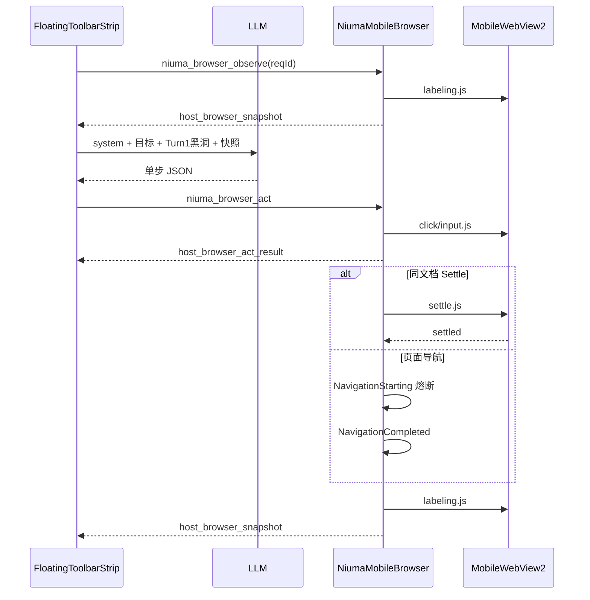

# 手机浏览器 Element Labeling（Browser Agent 单步循环）

## 构建结构

```
牛马nmer/
├── modules/
│   ├── NiumaMobileBrowser.ahk
│   ├── niuma_mobile_labeling.js
│   ├── niuma_mobile_settle.js      # 网络空闲 + DOM 静默 Settle
│   ├── niuma_mobile_click.js
│   └── niuma_mobile_input.js
├── html/FloatingToolbarStrip.html  # Browser Agent + Chat UI
└── md/docs/MOBILE_BROWSER_GROUNDING.md
```

## 单步 Tool Loop



**原则：** 每轮 LLM 仅输出一个 `browser_click` / `browser_input` / `browser_finish`；act 后宿主 Settle 再推送快照。

## JSON 协议（三工具）

```json
{
  "thought": "1-2 句",
  "tool": "browser_click | browser_input | browser_finish",
  "elementId": 6,
  "text": ""
}
```

- `elementId` 必须为**数字**类型（快照绿色徽章 id）。
- 禁止输出 `browser_observe`（快照由宿主自动推送）。

## Settle（`niuma_mobile_settle.js`）

1. **网络层（强制）**：hook `fetch` / `XHR`，`activeRequests === 0` 持续 ≥350ms。
2. **DOM 层**：`MutationObserver`，在网络 quiet 后 DOM 静默 ≥900ms。
3. **单向报信**：Settle 脚本满足条件后发送 `niuma_settle_done(reqId)` 给宿主网关。
4. **导航兜底**：`NavigationStarting` 标记导航态；`NavigationCompleted` 进入 `CentralSettleGate`。
5. **硬超时**：AHK 12s watchdog 触发 `CentralSettleGate(watchdog)`，避免死锁。

页面加载时 `NIUMA_MOBILE_INJECT_JS` 预装网络 hook。

## IconHint

- 无文本节点：`text` 形如 `(无文本#3) [IconHint:icon-search]`。
- 白名单：`aria-label` / `title` / 语义 class token（search/cart/close/menu/submit…），**禁止** Tailwind 布局类噪声。
- 装饰 SVG 不单独打标；Hint **冒泡**到可点击父节点。

## 文本黑洞（Turn-1）

- Chat 启动 Agent 时 `niuma_get_hole_context` → `host_hole_context`。
- 仅**首轮** user 消息附带 `【文本黑洞上下文 · 仅首轮有效】`；后续轮次不再附带，避免注意力漂移。

## 停滞 Kill Switch

- 连续多轮（默认 **3 次**）动作后快照**指纹**仍与上一轮相同：Chat 侧 **暂停 AI** 并提示手动处理后发「继续」。
- 指纹除 `url`、元素数、首节点文本、前 15 项 id/tag/text 外，另含 **input/textarea 的 value 摘要**（`|iv=…`），避免「已填词但 DOM 列表仍像百度首页」被误判为无进展。

指纹：`url` + 元素数量 + 首节点文本 + 前 15 项 id/tag/text + **可选 `iv`（输入框当前值摘要）**。

## 搜索类任务

- **由大模型**根据首轮快照选择 `browser_click` / `browser_input` / `browser_finish`，无宿主侧百度/谷歌 URL 规则直达。
- 打开浏览器时仅根据用户话术解析**站点首页**（如 `google.com`、`baidu.com`），不代替模型构造搜索结果 URL。

## GroundingCache L1（SQLite，面向搜索 follow-up）

- `niuma_mobile_labeling.js` 在打标时为候选元素计算 `roleHint`（`search_input`/`search_submit`/`generic`）以及高权重 selector（透传到快照字段 `sel`）。
- `modules/GroundingCache.ahk` 以 `host + intent_template + page_fingerprint + tool + target_roleHint` 为键，把 `selectorTop1(sel)` 与 `textTemplate`（如按钮文字）缓存下来。
- `FloatingToolbarStrip.html` 在本地规划缺失时会先查缓存：通常用于「输入成功后，点击搜索提交按钮」的 elementId 回填，从而跳过多余的大模型决策。

### resolve-id 动态自愈桥（L1 命中后的最后一步校验）

- 新增 `modules/niuma_mobile_resolve.js`：给定 `selector + roleHint`，直接在**真实 DOM**中定位目标元素，并分配/复用 `data-niuma-label-id`。
- 新增宿主桥：`niuma_browser_resolve` → `host_browser_resolve_result`（由 `NiumaMobileBrowser_ResolveElement` 处理）。
- 触发时机：仅用于 **L1 缓存命中后且快照定位失败** 的补救，不替换现有快照解析主路径。
- 收益：
  - 快照 Top-N 裁剪漏元素时，仍可跨越快照限制执行（减少“断层挂掉”）。
  - 若命中 roleHint 但 selector 失效，resolve 会回传 `selectorUsed/repaired`，前端会自动回写缓存实现动态自愈。

## L2 旁路底座（sqlite-vec）

本阶段仅验证 **扩展载入 + vec0 向量读写**，不接入 Embedding、FloatingToolbar 决策链，也不与 L1 联合查询。L2 初始化失败时只写日志，**L1 `GroundingCache_Get/Set` 仍可用**。

| 项 | 说明 |
|----|------|
| 扩展文件 | [`lib/vec0.dll`](lib/vec0.dll)（[sqlite-vec v0.1.9 loadable-windows-x86_64](https://github.com/asg017/sqlite-vec/releases/tag/v0.1.9)，官方包内模块名即为 `vec0.dll`，非 `sqlite-vec.dll`） |
| 运行时 SQLite | 项目根 [`sqlite3.dll`](../sqlite3.dll)（须支持 `load_extension`；烟测脚本通过 `sqlite3_enable_load_extension` 兜底） |
| 旁路 API | `modules/GroundingCache.ahk`：`GroundingCache_TryEnableL2` / `GroundingCache_RunL2SmokeTest` |
| 烟测表 | 虚拟表 `vec_l2_smoke`（`float[8]`，与官方 README 示例一致；生产 `float[384]` 留到 Embedding 里程碑） |
| 日志 | [`Cache/grounding_l2.log`](../Cache/grounding_l2.log) |

### 烟测

1. 将 `vec0.dll` 放入 `lib/`（与根目录 `sqlite3.dll` 同为 **x64**）。
2. 运行 [`tools/grounding_l2_smoke.ahk`](../tools/grounding_l2_smoke.ahk)（脚本在 `tools/` 下，会写入 `tools/SQLiteDB.ini` 指向 `..\sqlite3.dll`；**勿在 ini 中写含中文的绝对路径**，否则 `IniRead` 可能失败）。
3. **成功判据**：弹窗或日志含 `vec_version`（如 `v0.1.9`），且 KNN 返回 1 行有限 `distance`（烟测期望 `sample_id=2`、`distance≈2.39`）。
4. **失败降级**：删除或移走 `lib/vec0.dll` 后烟测应明确失败；`Data/GroundingCache.db` 内 L1 表 `grounding_cache` 仍可正常读写。

## LLM 提速（对齐 browser-use）

参考 [browser-use references](https://github.com/browser-use/browser-use/tree/main/skills/browser-use/references) 与 DomService 思路：

| 策略 | 说明 |
|------|------|
| **索引列表** | 发给模型：`[id] tag type "text" hint`，不用长 TSV/JSON |
| **Top-N 可点项** | 每轮最多 14 条（`pickElementsForBrowserLlm` 打分排序） |
| **单条 state 消息** | `buildBrowserAgentLlmMessages`：system + 目标 +（可选）上一步摘要 + **当前**快照；**不**在多轮中堆叠历史快照 |
| **小输出** | `max_tokens=384`，关闭 `json_mode`，`temperature=0.1` |
| **标注上限** | `niuma_mobile_labeling.js`：`MAX=56`、`MAXTXT=72`，减轻 observe 与 postMessage 体积 |

模型仍可能需数秒～十余秒（取决于 API 与模型）；建议设置里选用 **高速** 对话模型（如 `deepseek-chat`、`MiniMax-M2.1-highspeed`），避免 reasoning/超大上下文模型做网页单步决策。

### 搜索首页本地规划（免 LLM 首轮）

当 URL 为 Google/Baidu **首页**、用户目标含「谷歌/百度 + 搜索 + 关键词」时，Chat 用快照中的 `textarea`/`searchbox` 直接生成 `browser_input`，**不调用大模型**（避免 45～120s API 超时）。若 API 仍超时且能解析出搜索词，会 **fallback** 到同一本地规划。

## Google / 现代搜索框填表

- 打标：`textarea[name="q"]`、`[role="searchbox"]` 优先，`preferActElement` 将 id 绑到真实可编辑节点，并去重重叠绿框。
- 输入：`niuma_mobile_input.js` 使用 native value setter + `InputEvent`；搜索提交**异步**（`setTimeout`）。
- **Act 执行**：`click`/`input` 使用 `ExecuteScriptAsync().await()`（与 labeling 相同）；**禁止**依赖 `chrome.webview.postMessage`（Google 首页无此 API，会 45s `job_timeout`）。
- **兜底**：填词成功后 AHK 约 450ms 对 Google/Baidu 执行 `Navigate(search?q=…)`。
- 点击：`niuma_mobile_click.js` 对包装层解析内层 input/textarea，并用 `elementFromPoint` 校正命中。

## postMessage

| 前端 → AHK | AHK → 前端 |
|------------|------------|
| `niuma_browser_observe` | `host_browser_snapshot` |
| `niuma_browser_act` | `host_browser_act_result` / `host_browser_act_error` |
| `niuma_get_hole_context` | `host_hole_context` |
| 页面 `niuma_settle_done` | （经 `CentralSettleGate` → 快照） |
| `niuma_browser_pause_ai` | `host_browser_ai_busy` |

### `host_browser_snapshot` 载荷（直通车 MVP）

宿主 **不对** `LastElementsJson` 做 `Jxon_Load`/`Jxon_Dump`；将 WebView 标注脚本产出的 JSON 数组片段 **原子嵌入** `data.snapshot`，经 `WebView_QueueJson` → `PostWebMessageAsJson` 投递。Chat 侧 `normalizeBrowserSnapshot` 解包后 `elements` 已是原生数组，**无需** `JSON.parse(elementsJson)`。

```json
{
  "type": "host_browser_snapshot",
  "data": {
    "reqId": "snap-…",
    "count": 52,
    "arrLen": 52,
    "url": "https://…",
    "error": "",
    "truncated": false,
    "totalCandidates": 52,
    "snapshot": [ { "id": 1, "tag": "input", … } ]
  }
}
```

| 字段 | 说明 |
|------|------|
| `data.reqId` | 与 Chat `browserAgentSnapReqId` 对齐，串台拦截 |
| `data.snapshot` | 原生 JSON 数组（非字符串字段） |
| `data.count` / `data.arrLen` | 宿主 `LastElementsCount`，应与 `snapshot.length` 一致 |
| `data.error` | 非空表示失败（如 `browser_not_open`），此时 `snapshot` 可为 `[]` |

**已废弃热路径：** Map + `elementsJson` + `Jxon_Dump`。旧版扁平 `elementsJson` 顶层消息仍由 `parseSnapshotElements` 只读兼容。

## `host_browser_act_error.stage`（排障）

| stage | 含义 | 典型原因 |
|-------|------|----------|
| `inject` | 脚本注入/自检 | `modules/niuma_mobile_*.js` 缺失、UTF-8 损坏、长度校验失败 |
| `action_click` | 物理点击 | 元素 id 无效、页面脚本返回 `ok:false`、ExecScript 超时 |
| `action_input` | 填表输入 | 同上 |
| `settle` | 页面稳定等待 | AJAX/反爬死锁、Settle 传感器未上报、watchdog 12s |
| `label` | 打标测绘 | labeling.js 执行失败、解析为空 |

Chat 进度面板通过 `formatBrowserHostActError` 将 stage + error 渲染为分阶段提示。

## 调试日志（`Cache/niuma_mobile_snapshot_debug.log`）

统一格式：`[时间戳] [前缀] [ReqId: xxx] 上下文`

| 前缀 | 用途 |
|------|------|
| `[GUARD]` | 脚本加载、长度硬防御 |
| `[JOB_LAUNCH]` | ExecScript / 打标·点击·输入派发 |
| `[JOB_CALLBACK]` | 脚本执行结果（含 WebMessage job） |
| `[GATE_FLOW]` | Settle 三路合流（sensor / nav / watchdog） |
| `[CHAT_OUT]` | 快照或错误封包投递 Chat |

按 `ReqId:` 在日志中 Ctrl+F 可还原整条 Tool Loop 时间线。

## 验证

1. 重载 AHK，NiuMa Chat → 🌐 打开手机浏览。
2. `@网页 百度搜索 AutoHotkey` → 应「直达」后多轮单步表，非三连宏。
3. 划选文本后发 `@网页 填入搜索框` → 仅首轮含黑洞上下文。
4. `Cache/niuma_mobile_snapshot_debug.log`：按 reqId 检索 `[GATE_FLOW]` / `[CHAT_OUT]`。
5. 停滞两轮 → 立即暂停，无第 3 次 LLM 调用。
